# Подробное описание SSL/TLS и его криптографической системы
Думаю, многие из вас, кто читает эту лекцию, знают о HTTPS, а некоторые из 
вас могут настроить SSL/TLS для своего веб-сервера. Но сколько из вас глубоко
понимают как работает SSL/TLS?

Знаете ли Вы что на самом деле происходит во время TLS-рукопожатия?

Зачем нужно рукопожатие?

Какие криптографические алгоритмы используются TLS для защиты данных?

Зачем нужны цифровые сертификаты?

Почему он должен быть подписан центром сертификации?

Что такое цифровая подпись и как она создается?

Можно задать ещё много вопросов и я не хочу поверхностно рассмотреть их, 
поэтому это будет хорошая подробная лекция, рассказывающая всё о SSL/TLS,
чрезвычайно важной составляющей безопасности в Интернете.

## Что такое SSL/TLS?
SSL расшифровывается как Secure Socket Layer или Уровень Защищённых Сокетов. 
Это предшественник TLS, аббревиатура от Transport Layer Security (Протокол 
защиты транспортного уровня), который является криптографическим протоколом, 
обеспечивающий безопасную передачу данных между узлами компьютерной сети. 
Углубимся немного в историю SSL и TLS.

## История SSL/TLS
SSL был первоначально разработан Netscape и впервые опубликован в 1995 году
сразу с версии 2.0. Версия 1.0 не была выпущена из-за ряда серьезных 
недостатков безопасности. В 1996 году вышел SSL 3.0 - полностью 
переработанная версия протокола. Затем, 3 года спустя, в RFC 2246 инженерным 
советом Интернета (IETF) впервые был определен TLS 1.0 в виде обновления для 
SSL 3.0. На обновление до версии 1.1 в 2006 году ушло 7 лет. TLS 1.2 вышел
сразу же после него в 2008. Затем, наконец, после 10 лет разработки, в 2018 
вышел TLS 1.3, содержащий множество улучшений. Так какие версии SSL/TLS всё 
ещё существуют на данный момент?
SSL 2.0 был признан устаревшим в 2011 году, SSL 3.0 - в 2015 году, а недавно
в марте 2020 года эта же участь постигла TLS 1.0 и TLS 1.1. Таким образом, в 
настоящее время рабочими версиями являются только TLS 1.2 и 1.3.

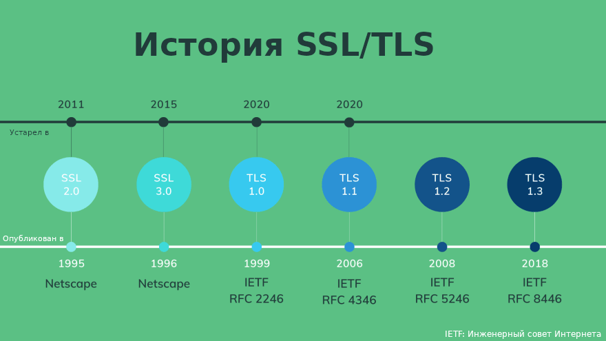
**Рисунок 1** - История SSL/TLS.

## Где используется TLS?
Давайте посмотрим, где применяется TLS. Прежде всего он широко используется в
сети. Все веб-сайты, которые вы посещаете с помощью HTTPS защищены TLS и мы
часто говорим о HTTP поверх TLS. По аналогии электронная почта с протоколом 
SMTPS фактически является SMTP поверх TLS, а FTPS - протокол для безопасной 
передачи файлов — это также FTP плюс TLS. Существует также множество других 
приложений, где применяется TLS, не будем тратить время упоминая все.

## Почему нам нужно использовать TLS?
Почему он так важен? Поточу что TLS позволяет:

* во-первых, осуществлять аутентификацию. TLS проверяет на подлинность 
  взаимодействующие стороны, которыми обычно являются клиенты и серверы. С 
  помощью асимметричной криптографии TLS гарантирует, что мы перейдём на 
  настоящий веб-сайт, а не поддельный. 

* во-первых, обеспечивать конфиденциальность. TLS защищает передаваемые данные
  от несанкционированного доступа, шифруя их с помощью симметричных алгоритмов 
  шифрования.

* и в-третьих, реализовать целостность. TLS распознаёт любые изменения в 
  данных во время передачи, проверяя код аутентификации сообщения, о котором 
  мы узнаем чуть позже.

## Как работает TLS?
По сути, TLS состоит из 2 фаз или 2 протоколов.
Первый — протокол рукопожатия. На этой фазе клиент и сервер будут
* согласовать версию протокола,
* выбрать криптографический алгоритм или наборов шифров,
* аутентифицировать друг друга с помощью асимметричной криптографии
* установить общий секретный ключ, который будет использоваться для 
  симметричного шифрования на следующей фазе.

Таким образом, основная цель рукопожатия — аутентификация и обмен ключами.

Вторая фаза — протокол записи. На этой фазе
* все исходящие сообщения будут зашифрованы с помощью общего секретного ключа,
  установленного при рукопожатии.
* затем зашифрованные сообщения передаются другой стороне.
* их проверяют, чтобы увидеть, возникли ли какие-то изменения во время 
  передачи или нет.
* если нет, то сообщения будут дешифрованы с использованием того же 
  симметричного секретного ключа. 

Таким образом, мы добьемся как конфиденциальности, так и целостности в этом 
протоколе записи, и поскольку объем зашифрованных данных на этом этапе велик,
его часто называют шифрованием больших объемов данных.

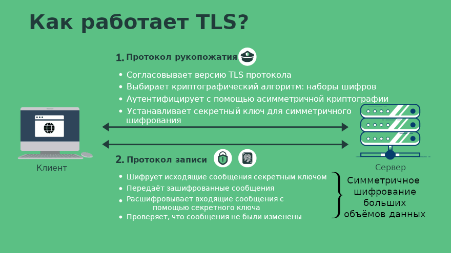
**Рисунок 2** - Как работает TLS?

## Почему TLS использует как симметричную, так и асимметричную криптографию?
Почему бы просто не использовать только какую-то одну? Легко показать, что
симметричная криптография не может обеспечить аутентификацию, поскольку
существует единственный секретный ключ для клиента и сервера, то есть
они никак не могут проверить подлинность друг друга. Не говоря уже о том, что
тяжело реализовать обмен ключами, предотвратив его утечку, при передаче через 
публичную сеть. А что если использовать асимметричную криптографию? На первый
взгляд хорошее решение. К сожалению, она работает намного медленнее 
симметричной. Под "намного" я имею в виду от 100 до 10000 раз медленнее. Таким
образом, оно явно не подходит для шифрования больших объемов данных.

## Симметричная криптография
Теперь давайте более подробно рассмотрим принцип симметричного шифрования. 
Думаю вы уже знакомы с основами. Пусть у Алисы есть текстовое сообщение, 
которое она хочет послать Бобу, но не хочет, чтобы кто-либо в публичной сети
его прочитал. Поэтому она шифрует сообщение секретным ключом, которым они 
ранее поделились друг с другом. Затем она отправляет зашифрованное сообщение 
Бобу через общедоступный Интернет. Получив зашифрованное сообщение, Боб легко 
использует тот же секретный ключ для его расшифровки. Поскольку для шифрования 
и дешифрования используется один и тот же ключ, оно является своего рода 
симметричным, отсюда и название "симметричное шифрование". Но может 
существовать хакер Гарри, который сможет перехватить их сообщение в публичной 
сети. Тем не менее, сообщение будет зашифровано и Гарри без секретного ключа
не сможет его расшифровать. Но он всё ещё может его изменить! 

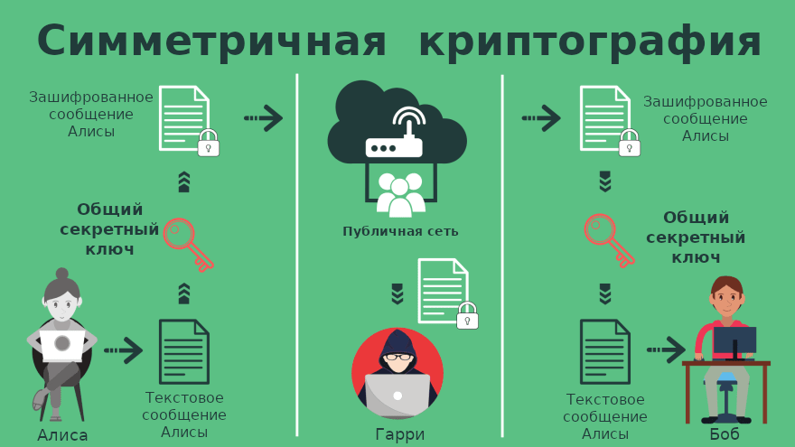
**Рисунок 3** - Симметричная криптография

### Атака, подменивающая биты
Существует метод под названием "атака, подменивающая биты", который работает
следующим образом. Допустим на этот раз Алиса обменивается сообщениями не с 
Бобом, а со своим онлайн-банком, и она хочет отправить кому-то 100 долларов. 
Сообщение шифруется секретным ключом и посылается банку через Интернет. После
этого Гарри перехватывает зашифрованное сообщение. Хотя он не может 
расшифровать его, но может изменить некоторые биты с 1 на 0 и с 0 на 1, 
а затем переслать это измененное сообщение в банк. Теперь, когда банк 
расшифрует его, они получат другое текстовое сообщение. В данном случае 100
долларов изменилось на 900. Так что это очень опасно. Вот почему нам нужно 
убедиться, что зашифрованное сообщение не было изменено во время передачи. Но
как?

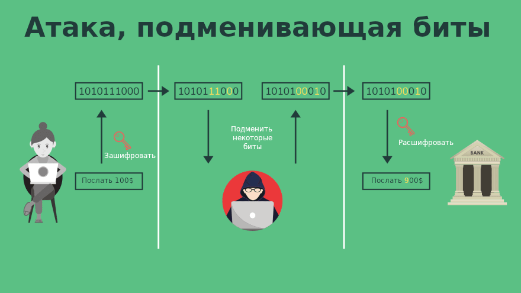
**Рисунок 4** - Атака, подменивающая биты

### Аутентифицированное шифрование (AE)
Один из способов сделать это — использовать аутентифицированное шифрование. 
Идея заключается в том, чтобы не просто зашифровать, но и проверить на 
подлинность зашифрованное сообщение. Первый шаг — шифрование. Текстовое 
сообщение Алисы проходит через алгоритм симметричного шифрования, например, 
AES-256-GCM или CHACHA20. Этот алгоритм шифрования также принимает в качестве 
входных данных общий секретный ключ и одноразовый код, выбранный случайным
образом (nonce) или вектор инициализации (IV). Он вернет зашифрованное 
сообщение. Второй шаг — аутентификация. Зашифрованное сообщение, секретный 
ключ и nonce становятся входными данными для алгоритма MAC, например, GMAC,
если вы используете AES-256-GCM, или POLY1305, если применяете алгоритм 
шифрования CHACHA20. Этот MAC алгоритм ведёт себя как криптографическая 
хеш-функция, на выходе получается MAC или код аутентификации сообщения. Теперь
этот MAC будет прикреплен к зашифрованному сообщению и окончательный результат
отправляется Бобу. Из-за этого мы иногда называем этот MAC тегом 
аутентификации. В TLS 1.3, кроме зашифрованного сообщения, мы также хотим
аутентифицировать некоторые связанные данные, такие как адреса, порты, версия 
протокола или номер последовательности. Эта информация не зашифрована и 
известна обеим сторонам. Таким образом, связанные данные также являются 
входными параметрами для алгоритма MAC, и из-за этого весь процесс называется 
аутентифицированным шифрованием со связанными данными, или, сокращенно, AEAD.
Теперь посмотрим, как Боб может проверить, что зашифрованное сообщение не было
изменено во время передачи. Можно просто выполнить алгоритм в обратном 
порядке. Имея зашифрованного сообщения с MAC, мы отделяем MAC от него. Затем
зашифрованное сообщение отправляется в алгоритм MAC вместе с общим секретным 
ключом и nonce. Обратите внимание, что это тот же nonce, который используется 
в процессе шифрования. Обычно nonce добавляется к зашифрованному сообщению
перед отправкой получателю. Связанные данные также поступают в алгоритм MAC, 
и на выходе будет другой MAC. Теперь Боб может просто сравнить два значения
MAC. Если они разные, то он знает, что зашифрованное сообщение было изменено.
В противном случае он может безопасно расшифровать сообщение и использовать 
его, будучи уверенным в том, что это то же текстовое сообщение, которое послала
Алиса.

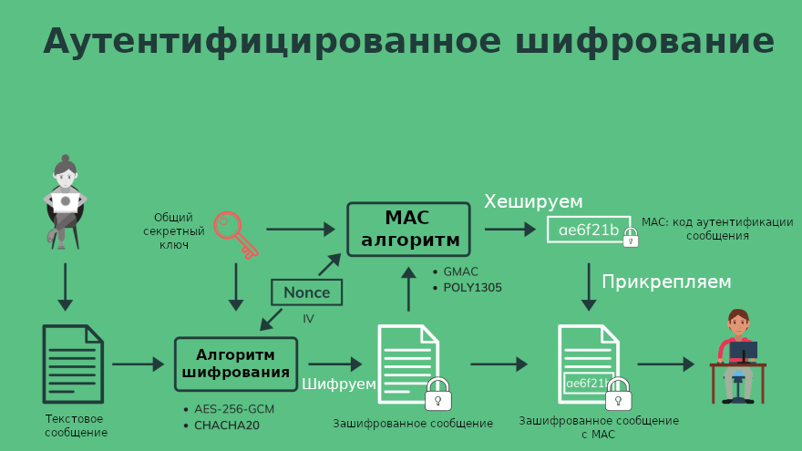
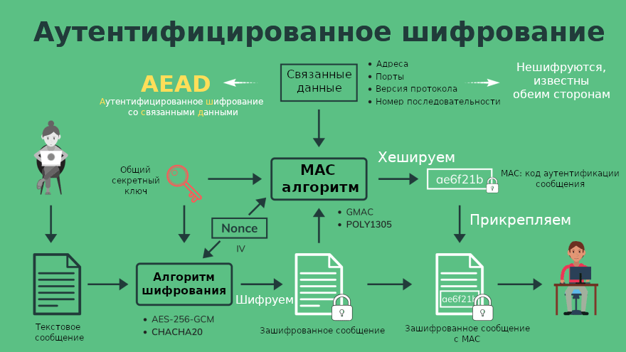

**Рисунок 5** - Аутентифицированное шифрование

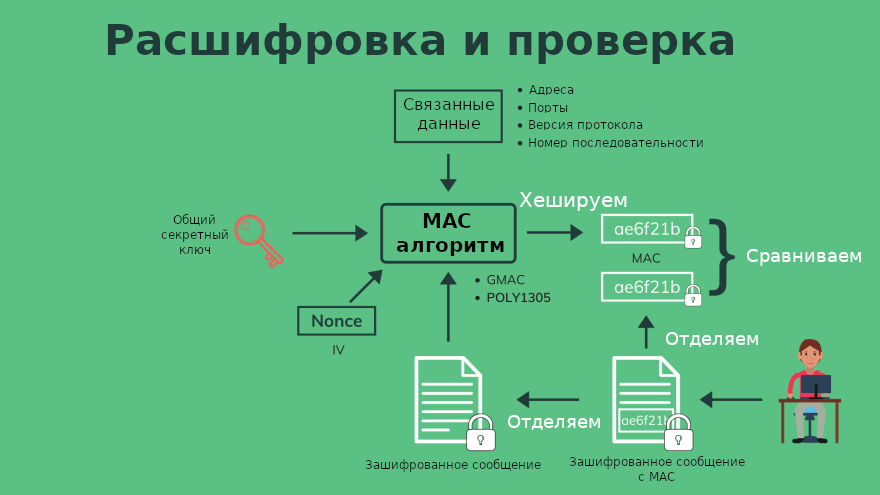
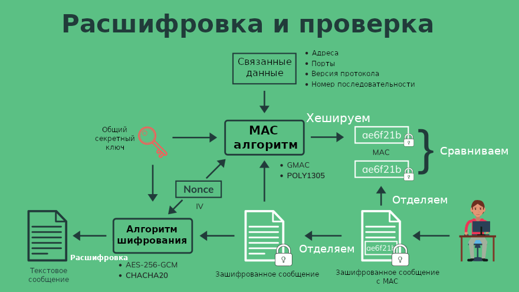

**Рисунок 6** - Расшифровка и проверка

### Обмен секретным ключом
Возникает вопрос: как Боб и Алиса делятся секретным ключом друг с другом, не
раскрывая его другим? Ответ таков: для этого они должны использовать 
асимметричное шифрование или шифрование с открытым ключом, а именно, 
эфемерный протокол Диффи-Хеллмана или эфемерный протокол Диффи-Хеллмана на
эллиптических кривых.

#### Протокол Диффи-Хеллмана
Рассмотрим принцип работы протокола Диффи-Хеллмана. Во-первых, Алиса и Боб
договариваются о двух числах: базе g и модуле p. Эти числа публично доступны.
Затем каждый из них выбирает никому не известное секретное число: Алиса — число
`a`, Боб — число `b`. Затем Алиса вычисляет свой открытый ключ `A` равный `g`
в степени `a` по модулю `p` и посылает его Бобу. Аналогично Боб вычисляет 
свой открытый ключ `B` как `g` в степени `b` по модулю `p` и отправляет Алисе.
Затем Алиса получает открытый ключ `B`, а Боб — `A`. Дальше происходит магия.
Алиса вычисляет `B` в степени `a` по модулю `p`, а Боб — `A` в степени `b`
по модулю `p` и эти два числа магическим образом равны одному и тому же числу
`S`. Почему? Потому что если вы осуществите вычисления, то они будут равны
`g` в степени `a` умножить на `b` по модулю `p`. Таким образом, Алиса и Боб
получили одно и то же секретное число S, не раскрыв его.

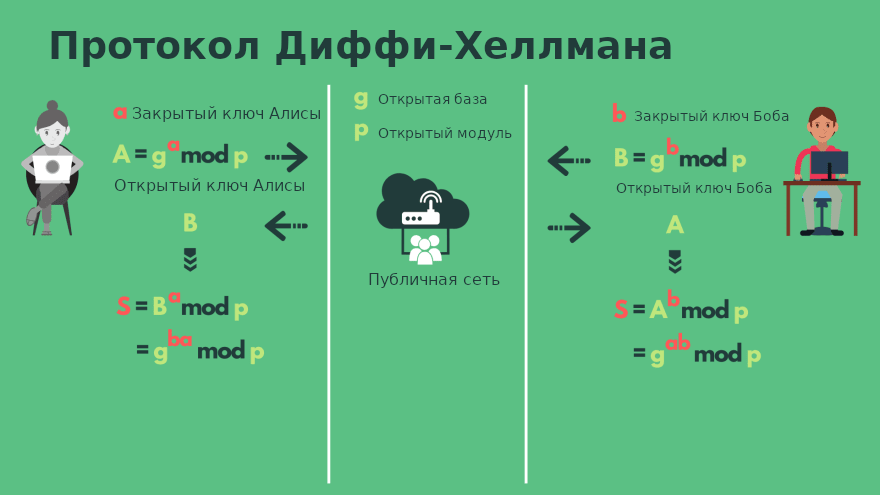
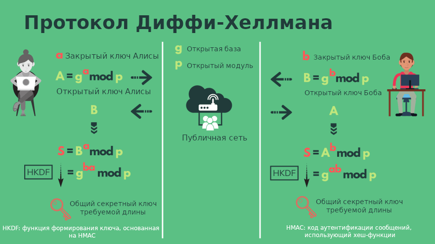
**Рисунок 7** - Протокол Диффи-Хеллмана

#### Функция формирования ключа - KDF
Однако имейте в виду, что для каждого алгоритма шифрования может потребоваться 
секретный ключ разной длины. Таким образом, чтобы создать секретный ключ, Алиса
и Боб должны передать `S` в одну и ту же функцию формирования ключа. На выходе 
они получат общий секретный ключ необходимой длины. В TLS 1.3 мы используем
функцию формирования ключа, основанную на HMAC, поэтому называющуюся HKDF. 
Давайте чуть подробнее рассмотрим эту функцию формирования ключа. Как правило,
KDF принимает некие данные о ключе или IKM на вход. В нашем случае IKM — это
число `S`. Нам нужно сообщить KDF, какой длины должен быть выходной ключ, 
например, 128-битным. Затем KDF также требуется криптографическая хеш-функция, 
например, HMAC-SHA256, и необязательно некая контекстная или специфическая для
приложения информация и соль. Используя эти входные данные, KDF создаст 
секретный ключ требуемой длины.

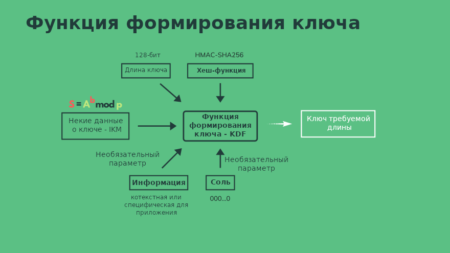
**Рисунок 8** - Функция формирования ключа

#### Односторонняя функция с потайным входом
Теперь вернемся к протоколу Диффи-Хеллмана. Мы знаем, что `p`, `g`, `A` и `B` 
известны публично. Это означает, что хакер Гарри также имеет доступ к этим 
числам. Насколько безопасен этот механизм обмена ключами? Или, зная `p`, `g`, 
`A` и `B`, сможет ли Гарри получить секретные числа `a`, `b` и `S`? К счастью 
эти функции являются односторонними, если мы выберем правильные значения для
чисел `p`, `g`, `a` и `b`. Например, выберем для `p` 2048-битное простое число,
`g` будет первообразным корнем по модулю `p`, а `a` и `b` — 256-битными 
случайными целыми числами. Односторонняя функция с потайным входом так 
называется, потому что её легко вычислить в одну сторону, но сложно обратить. 
В нашем случае, зная `p`, `g`, `a` легко вычислить `A`. Но если известно `p`, 
`g` и `A` очень трудно найти `a`. Легко показать, что `A` можно вычислить 
достаточно быстро с временной сложностью `O(log(a))`. Это хорошо известная 
задача возведения в степень по модулю. Вычислить `a`, напротив, намного 
сложнее. Это задача дискретного логарифмирования, на решение которой у 
современных компьютеров уходит очень много времени. Так что мы, по крайней 
мере, на данный момент в безопасности, пока не появятся следующее поколение 
мощных квантовых компьютеров. То есть, если сейчас "уходит очень много времени"
это не означает, что задачу решить невозможно, верно?

**Рисунок 9** - Односторонняя функция с потайным входом

#### Статический или эфемерный ключ?
Если Алиса и Боб используют одни и те же закрытые ключи, `a` и `b` для каждой 
сессии связи, то Гарри может записать все эти сессии и начать искать решение
для `a` из сессии 1. Хотя на решение уйдёт много времени, скажем, через `N` 
сессий он найдёт правильное `a`. Теперь он может использовать его для 
вычисления секретного числа `S` и, таким образом, расшифрует все записанные 
сессии. Звучит проблематично, не так ли? Как мы можем это предотвратить? Нужно
использовать эфемерный ключ. Как следует из названия, мы используем разные 
закрытые ключи для каждой сеанса связи. Даже если Гарри сможет найти секретный 
ключ за время одной сессии, он не сможет использовать его для других. В TLS это
называется совершенной прямой секретностью. Теперь вы понимаете почему 
протокола Диффи-Хеллмана называют эфемерным. Это связано с тем, что в нём
используются эфемерные или ключи с коротким сроком действия. Что тогда
означает фраза "эллиптические кривые" в названии протокола?

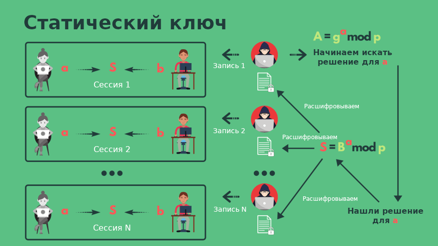
**Рисунок 10** - Статический ключ.

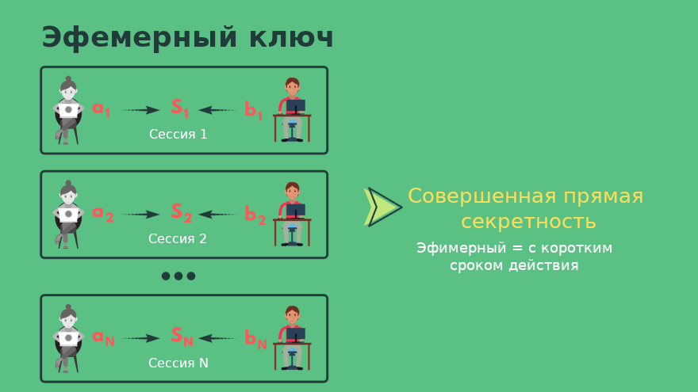
**Рисунок 11** - Эфемерный ключ.

## Криптография на эллиптических кривых
Итак, криптография на эллиптических кривых (или ECC) - это разновидность 
асимметричной криптографии со схожим алгоритмом работы, но с другой 
односторонней функцией с потайным входом. Эта односторонняя функция основана 
на алгебраической структуре эллиптических кривых, отсюда и название. Одним из 
потрясающих достоинств криптография на эллиптических кривых является то, что
для обеспечения эквивалентного уровня безопасности требуются ключи меньшего 
размера. Ниже это показано в виде сравнительной таблице с RSA. Агентство 
национальной безопасности США (АНБ) использовало для защиты своих 
сверхсекретных документов 384-битный ECC ключ, который обеспечивает тот же
уровень безопасности, что и 7680-битный ключ RSA. Потрясающе, не так ли? 
Однако, криптография на эллиптических кривых проще взломать, используя 
квантовые вычисления. [Алгоритм Шора](https://en.wikipedia.org/wiki/Shor%27s_algorithm)
может взломать ECC, используя гипотетический квантовый компьютер, потребляя 
меньше квантовых ресурсов, чем ему бы потребовалось на взлом RSA. Возможно, 
пройдут десятилетия, прежде чем этот мощный квантовый компьютер действительно 
будет создан и использован, но возможна ли какая-то защита? Существует ли
квантово-устойчивый алгоритм? Да, им является алгоритм обмена ключами на базе 
[протокола Диффи-Хеллмана с использованием суперсингулярной изогении](https://en.wikipedia.org/wiki/Supersingular_isogeny_key_exchange),
который также основан на криптографии эллиптических кривых. Но это совсем
другая история.

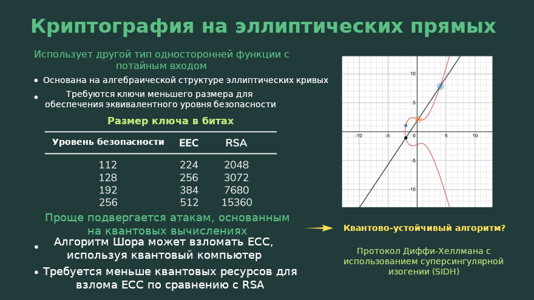
**Рисунок 12** - Криптография на эллиптических кривых.

## Асимметричная криптография
Теперь вернемся к асимметричной криптографии. Это потрясающая технология, 
имеющая широкий диапазон применения. Мы уже исследовали одно из его 
приложений, предназначенное для симметричного обмена секретными ключами с 
помощью эфемерного алгоритма Диффи-Хеллмана или эфемерного алгоритма
Диффи-Хеллмана на эллиптических кривых. На самом деле алгоритм RSA также 
использовался для обмена ключами в прошлом, но был удален в TLS 1.3 из-за того,
что подвержен различным атакам и отсутствия возможности прямой секретности.
Асимметричная криптография также используется в системе шифрования. Например,
асимметричными алгоритмами шифрования являются:

* RSA c оптимальным асимметричным шифрованием с дополнением
* RSA из первого стандарта криптографии с открытым ключом (RSA-PKCS1)
* схема Эль-Гамаля

И, наконец, ещё одно важное применение асимметричной криптографии — для
цифровой подписи, которую TLS широко использует для аутентификации. Некоторые 
популярные алгоритмы цифровой подписи, используемые в TLS, включают:
* RSA с вероятностной схемой подписи
* алгоритм цифровой подписи на эллиптических кривых
* алгоритм цифровой подписи, использующий вариант схемы Шнора, основанной на 
  эллиптической кривой Эдвардса.

Мы скоро рассмотрим алгоритмы создания цифровых подписей, а пока что давайте
узнаем как работает система асимметричного шифрования.

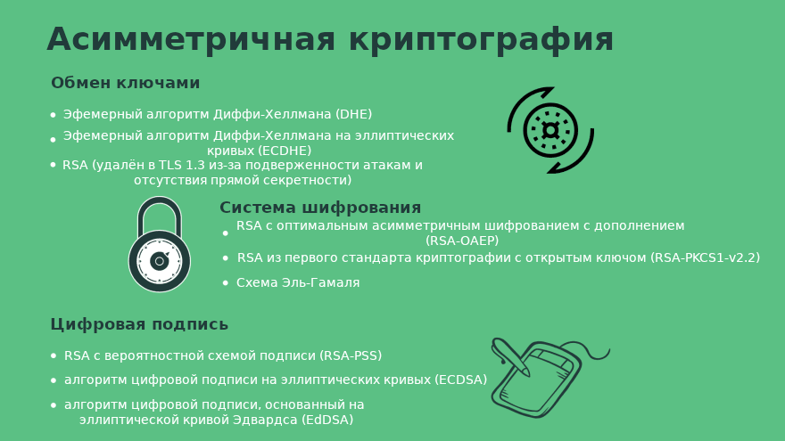
**Рисунок 13** - Асимметричная криптография.

## Асимметричное шифрование
Как и в примере с симметричным шифрованием, у Алисы есть текстовое сообщение, 
которое она хочет отправить Бобу. Но на этот раз общего секретного ключа нет.
Вместо этого Алиса шифрует сообщение открытым ключом Боба и отправляет 
зашифрованное сообщение Бобу. Когда Боб получает сообщение, он использует 
свой закрытый ключ для его расшифровки. Хотя открытый ключ и закрытый ключ 
различны, они все же связаны некой односторонней функцией, точно так же
как в алгоритме Диффи-Хеллмана. Идея такова: ключи формируются парами и 
только закрытый ключ из той же пары может расшифровать сообщение, зашифрованное
открытым ключом. Из-за этого, даже когда Гарри имеет доступ и к зашифрованному
сообщению Алисы, и к открытому ключу Боба, он не можем использовать его для 
расшифровки сообщения.

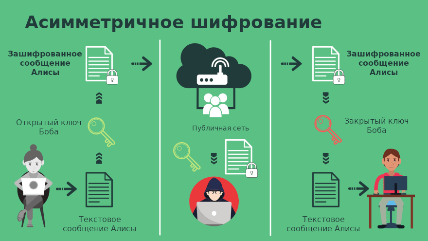
**Рисунок 14** - Асимметричное шифрование.

Таким образом, обмен публичными ключами всё упрощает. Боб просто отправляет 
ключ Алисе напрямую через общедоступный Интернет, не опасаясь, что он может 
быть использован для расшифровки сообщений. Ключ является открытым, поэтому 
любой может использовать его для шифровки сообщений, которые может прочитать
только Боб, даже если они никогда раньше не обменивались информацией друг с 
другом. Это действительно потрясающе, не правда ли? Тем не менее, не всё так
просто.

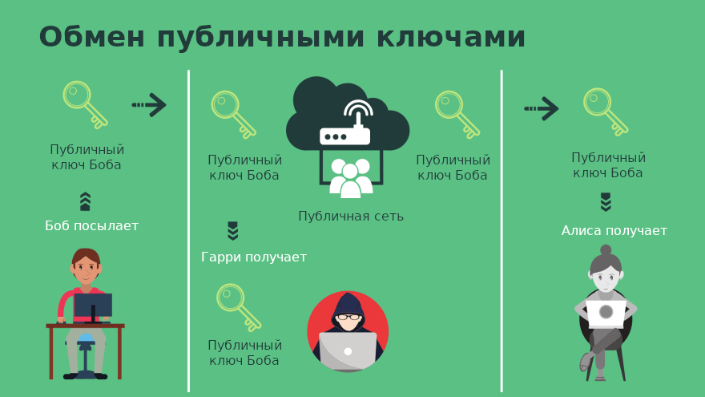
**Рисунок 15** - Обмен публичными ключами.

Хотя мы знаем, что Гарри не может расшифровать сообщение с помощью открытого 
ключа Боба, он всё же может помешать совместному использованию открытого ключа 
и заменить открытый ключ Боба на свой собственный открытый ключ. Теперь когда
Алиса получает ключ, она всё ещё думает, что это открытый ключ Боба, но на 
самом деле это ключ Гарри. Так что если Алиса зашифрует своё сообщение этим
ключом, Гарри сможет расшифровать его своим закрытым ключом. Ключ — это просто 
число и он не содержит никаких персональных данных о его владельце. Как же
быть? Очевидно, что мы должны объединить ключ с некоторыми персональными 
данными, то есть с цифровым сертификатом.

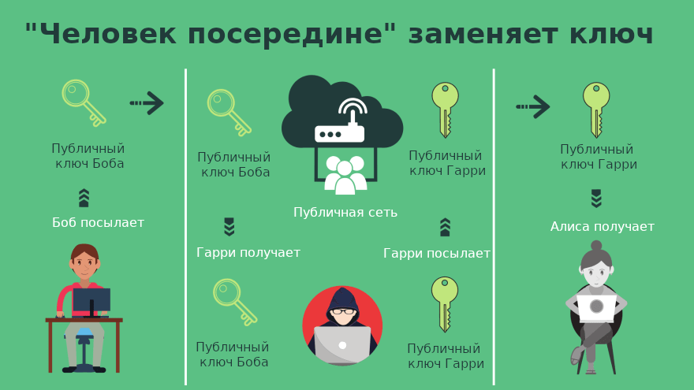
**Рисунок 16** - Атака "человек посередине".

## Цифровой сертификат
Таким образом, Боб добавляет свой ключ в сертификат, на котором указано его имя
и другие персональные данные. Сертификат служит аналогом паспорта в реальном 
мире. Но как мы узнаём, что этот сертификат действительно принадлежит Бобу? 
Что мешает Гарри создать поддельный сертификат на имя Боба, но с открытым 
ключом Гарри? Как и в реальном мире, паспорт должен быть выдан в паспортном 
столе после процесса проверки личности. В цифровом мире сертификат должен быть
проверен и подписан центром сертификации. Здесь центр сертификации и паспортный
стол являются доверенной третьей стороной, которая помогает нам предотвратить 
создание поддельных паспортов и цифровых сертификатов.

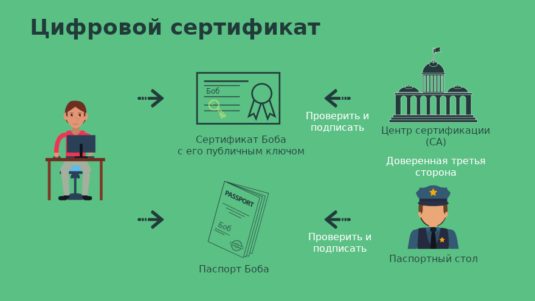
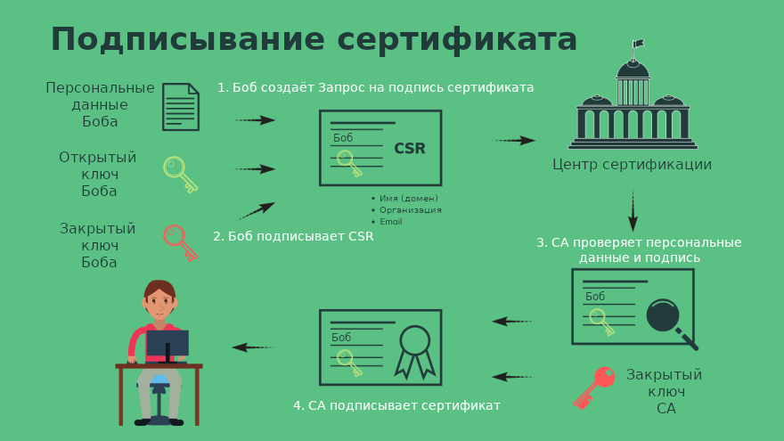
**Рисунок 17** - Подписывание сертификата.

Процесс подписания сертификата происходит следующим образом: у Боба есть
пара из открытого и закрытого ключа. На первом этапе он создаёт запрос на
подпись сертификата или CSR. Этот CSR содержит его открытый ключ и некоторые 
персональные данные, такие как имя, организация и адрес электронной почты. 
Затем на втором этапе, он подписывает CSR своим закрытым ключом и отправляет
его в центр сертификации. Центр сертификации проверяет персональные данные
Боба в сертификате. При необходимости они могут связаться с ним, чтобы 
запросить дополнительные доказательства. Затем они используют открытый ключ 
Боба в сертификате для проверки его подписи. Это необходимо для того, чтобы 
убедиться, что Бобу действительно принадлежит закрытый ключ, связанный с 
открытым ключом в сертификате. Если все в порядке, CA подпишет сертификат 
своим собственным закрытым ключом и отправит его Бобу.

### Совместное использование сертификата
Теперь Боб поделится с Алисой этим сертификатом, который содержит его открытый
ключ, вместо того, чтобы отправлять как раньше только открытый ключ. После 
получения сертификата Алиса может легко проверить его подлинность с помощью
открытого ключа центра сертификации. Из-за этого Гарри больше не может заменить
открытый ключ Боба своим, поскольку у него нет закрытого ключа CA для подписи
поддельного сертификата. Обратите внимание, что всё это работает, поскольку 
мы все доверяем центру сертификации. Если по какой-то причине CA нельзя 
доверять, например, они предоставили Гарри свой закрытый ключ, то у нас 
серьёзные проблемы!

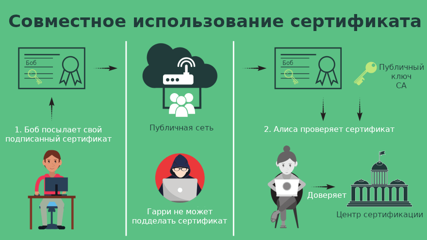
**Рисунок 18** - Совместное использование сертификата

## Центр сертификации — цепочка доверия
На самом деле существует цепочка центров сертификации, где на верхнем уровне
находится корневой центр сертификации, подписывающий свой собственный
сертификат, а также сертификаты подчиненного ему центра, который является
промежуточным центром сертификации. Он в свою очередь может подписать 
сертификат других промежуточных центров или конечный сертификат. Каждый 
сертификат будет ссылаться по цепочке на сертификат более высокого уровня и
так до корня. В ваших операционных системах и браузерах хранится список 
сертификатов доверенных корневых центров сертификации. Таким образом они могут 
легко проверить подлинность всех сертификатов. Хорошо, давайте проверим 
действующий TLS-сертификат Youtube! В Chrome нажмите на значок замочка в 
адресной строке и выберите Сертификат. Это конечный сертификат. Он был выпущен
Google Trust Services (GTS), используя алгоритм подписи RSA и хеширования
SHA-256. Открытый ключ сертификата использует криптографию на эллиптических 
кривых с размером ключа в 256 бит. Поэтому ключ выглядит таким коротким. Ниже
показана его подпись, заверенная GTS. Если мы прокрутим чуть ниже, то увидим,
что этот сертификат используется для многих веб-сайтов Google, включая
youtube.com и у него есть срок действия. Теперь давайте посмотрим на сертификат
центра, подписавшего этот сертификат. Это промежуточный центр сертификации и он 
называется Google Trust Services. У него также есть открытый ключ, но другого
типа: с RSA шифрованием. Таким образом, ключ намного больше: длиной 2048 бит и
он подписан корневым центром. Корневой центр сертификации — это GlobalSign,
имеющий самоподписанную подпись.

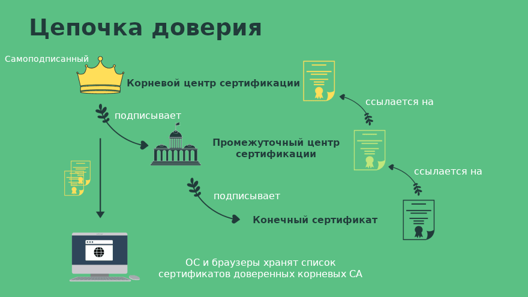
**Рисунок 19** - Цепочка доверия.

## Цифровая подпись
Мы многое рассказали о цифровой подписи, поэтому давайте посмотрим как она 
работает на самом деле! Чтобы подписать документ, подписывающая сторона сначала
должна его хешировать, а затем хеш-значение шифруется с помощью закрытого 
ключа подписывающей стороны. В результате получаем цифровую подпись. Затем
её можно прикрепить к исходному документу и в этом заключается процесс 
подписания. Как теперь убедиться, что подпись действительна? Просто 
осуществляем те же действия в обратном порядке. Сначала отделяем подписать от
документа, расшифровываем её с помощью открытого ключа подписывающей стороны,
чтобы получить хеш-значение. Затем мы хешируем документ, используя тот же 
алгоритм хеширования, который применялся в процессе подписания. В результате
получаем ещё одно значение хеша. Затем мы сравниваем два хеш-значения. Если 
они совпадают, значит подпись достоверна.

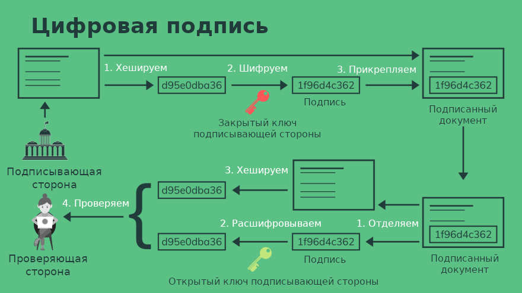
**Рисунок 20** - Цифровая подпись.

## Протокол рукопожатия TLS 1.3
Теперь используя все знания, полученные дло сих пор, давайте подробнее 
рассмотрим как они используются в протоколе рукопожатия TLS.

Процесс полного рукопожатия TLS 1.3 начинается с приветственного сообщения, 
которое клиент отправляет на сервер. На самом деле в сообщении содержится 
гораздо больше информации, но здесь я просто перечислю наиболее важную информацию. 

Сначала список версий протокола, с которыми может работать клиент. Затем список 
поддерживаемых наборов симметричных шифров AEAD. В этом случае существует
два варианта: AES-256-GCM или CHACHA20-POLY1305. После этого передаётся список
поддерживаемых методов обмена ключами. Например, в примере на рисунке клиент
поддерживает и эфемерный протокол Диффи-Хеллмана в конечном поле, и эфемерный
протокол Диффи-Хеллмана на эллиптических кривых. Вот поэтому клиент также 
передаёт два своих открытых ключа. Один — для Диффи-Хеллмана в конечном поле,
второй — для Диффи-Хеллмана на эллиптических кривых. Таким образом, сервер
может вычислить общий секретный ключ независимо от того какой алгоритм он 
выберет. Последнее поле, которое клиент отправляет в этом сообщении, 
представляет собой список поддерживаемых им алгоритмов подписи. Это позволяет
серверу выбрать какой алгоритм он должен использовать для подписи всего 
рукопожатия. Чуть позднее мы увидим как это работает. 

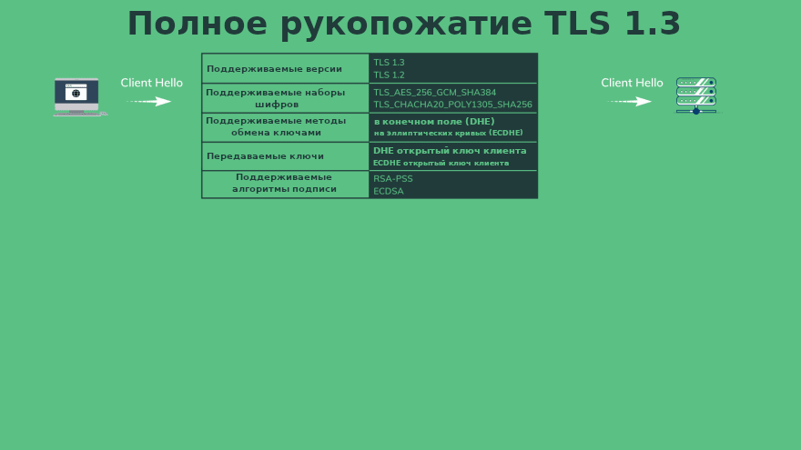
**Рисунок 21** - Процесс полного рукопожатия в TLS 1.3 (сообщение "Client Hello").

После получения приветственного сообщения клиента сервер также отправляет своё
сообщение «Server Hello», которое содержит выбранную версию протокола TLS 1.3,
выбранный набор шифров AES-256-GCM, выбранный метод обмена ключами: эфемерный 
протокол Диффи-Хеллмана и публичный ключ сервера для выбранного метода. 
Следующее поле — это запрос сертификата клиента, которое является 
необязательным и будет отправлен только в том случае, если сервер хочет
аутентифицировать клиента с помощью его сертификата. Обычно для сайтов на 
HTTPS только серверная сторона должна отправлять свой сертификат клиенту. Он
делает это в следующем поле сообщения.

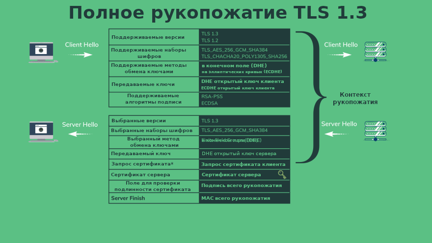
**Рисунок 22** - Процесс полного рукопожатия в TLS 1.3 (Сервер отвечает своим сообщением «Server Hello»).

Следующее поле — это проверка на подлинность сертификата, которая фактически
является подписью всего рукопожатия до этого момента. Вот как она создается:
все данные от начала рукопожатия до запроса сертификата называются контекстом
рукопожатия. Мы объединяем этот контекст с сертификатом сервера, хешируем его
и подписываем хеш-значение закрытым ключом сервера, используя один из 
алгоритмов подписи, которые поддерживает клиент. По аналогии поле Server 
Finish генерируется путём объединения контекста рукопожатия, сертификата и 
проверки на подлинность, хеширования этого значения через алгоритм MAC 
выбранного набора шифров. В результате получаем MAC всего рукопожатия.

Здесь поля `Server certificate`, `Certificate verify` и `Server finish` 
называются аутентификационными сообщениями, поскольку они используются для 
аутентификации сервера. Благодаря подписи и MAC всего рукопожатия TLS 1.3 
защищен от нескольких типов атак "человек посередине".

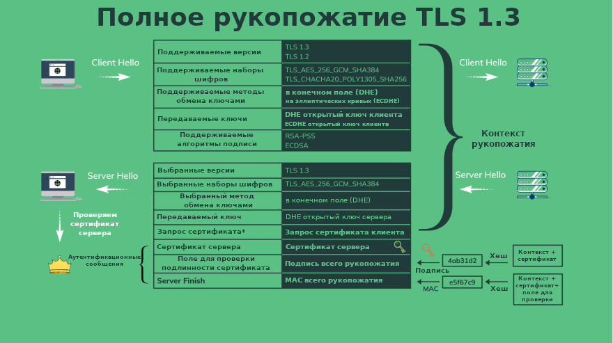
**Рисунок 23** - Процесс полного рукопожатия в TLS 1.3 (сообщение для аутентификации).

Теперь после того, как клиент получит приветственное сообщение от сервера, он 
проверит сертификат сервера с помощью корневого сертификата и проверит подпись
и MAC всего сообщения, чтобы убедиться, что они не были подделаны. Если все в 
порядке, клиент отправляет свое сообщение о завершении рукопожатия с MAC всего
рукопожатия до этого момента и при необходимости проверяется сертификат 
клиента на подлинность, если его запросил сервер.

Ниже показана вся последовательность действий процесса TLS рукопожатия.

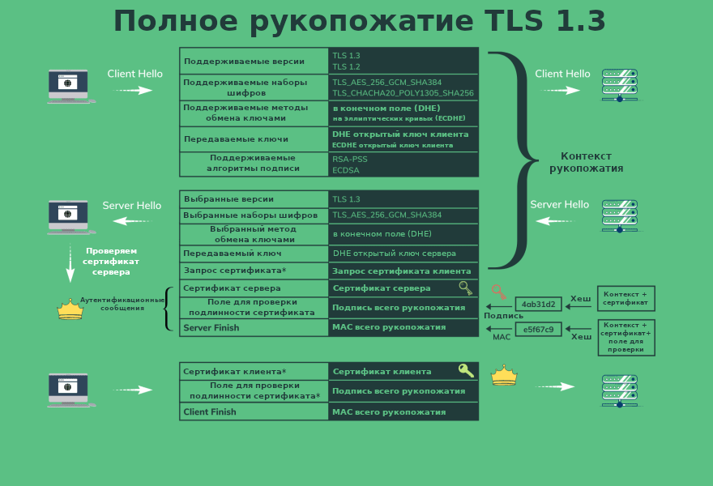
**Рисунок 24** - Процесс полного рукопожатия в TLS 1.3 (вся последовательность действий).

## Сокращенное рукопожатие, используя PSK с возобновлением
Чтобы повысить производительность, клиент и сервер не всегда осуществляют весь 
этот процесс полного рукопожатия. Иногда они выполняют сокращенное рукопожатие, 
возобновляя работу, используя ранее опубликованный ключ. Идея заключается в 
следующем: после предыдущего рукопожатия клиент и сервер уже знают друг друга,
поэтому им не нужно заново аутентифицироваться. Таким образом, сервер может
отправить клиенту один или несколько сеансовых тикетов, которые могут 
применяться в качестве идентификаторов ранее опубликованного ключа (PSK) при 
следующем рукопожатии. К ним относятся срок службы тикета, а также некоторая 
другая информация.

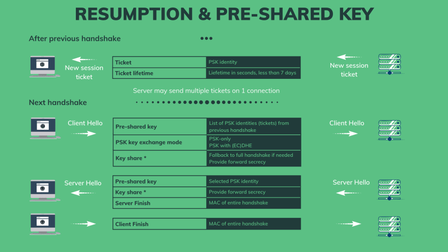
**Рисунок 25** - Возобновление и ранее опубликованный ключ.

Теперь в следующем рукопожатии клиент отправит простое приветственное 
сообщение, которое содержит список идентификаторов PSK (или тикетов), 
полученных из предыдущего рукопожатия, режим обмена PSK ключом, равный PSK 
только или PSK, применяя протокол Диффи-Хеллмана. Если используется режим
PSK с протоколом Диффи-Хеллмана, то клиент также должен поделиться своим 
открытым ключом Диффи-Хеллмана. Это обеспечит совершенную прямую секретность,
а также позволяет серверу вернуться к полному рукопожатию, если это необходимо.
Когда сервер получает приветственное сообщение клиента, он отправляет своё 
сообщение с выбранным идентификатором ранее опубликованного ключа, 
необязательный публичный ключ Диффи-Хеллмана и поле Server finish как при 
полном рукопожатии. Наконец, клиент отправляет Client Finish и на этом 
заканчивается PSK возобновление. Как видите, в этом сокращенном рукопожатии 
нет аутентификации сертификата между клиентом и сервером. Это также открывает 
возможность для нулевого времени возобновления приёма-передачи данных, то есть
клиенту не нужно ждать завершения рукопожатия, чтобы отправить свои первые 
данные приложения на сервер.

## Нулевое время возобновления приёма-передачи — 0-RTT
При 0-RTT, клиент посылает данные приложения вместе с приветственным сообщением
клиента. Эти данные шифруются с использованием ключа, полученного из первого
PSK в списке тикетов, а также добавляется ещё одно поле: указывающее на 
предварительную отправку данных, чтобы сообщить серверу, что были посланы 
данные приложения. Если сервер принимает этот 0-RTT запрос, то он отправляет 
сообщение «Server Hello» как и при обычном PSK возобновлении и необязательно
некоторые данные приложения. Клиент завершает процесс сообщением, содержащим 
MAC и индикатор конца предварительно отправленных данных. Вот как работает
нулевое время возобновления приёма-передачи в TLS 1.3. Его преимущество 
заключается в уменьшении времени задержки на один цикл приёма-передачи. А 
недостаток в потенциальной угрозе к атакам воспроизведения, когда хакер, сможет
скопировать и посылать один и тот же зашифрованный 0-RTT запрос на сервер 
несколько раз. Чтобы не допустить этого, серверное приложение должно быть 
реализовано таким образом, чтобы не допускать дублирования запросов.

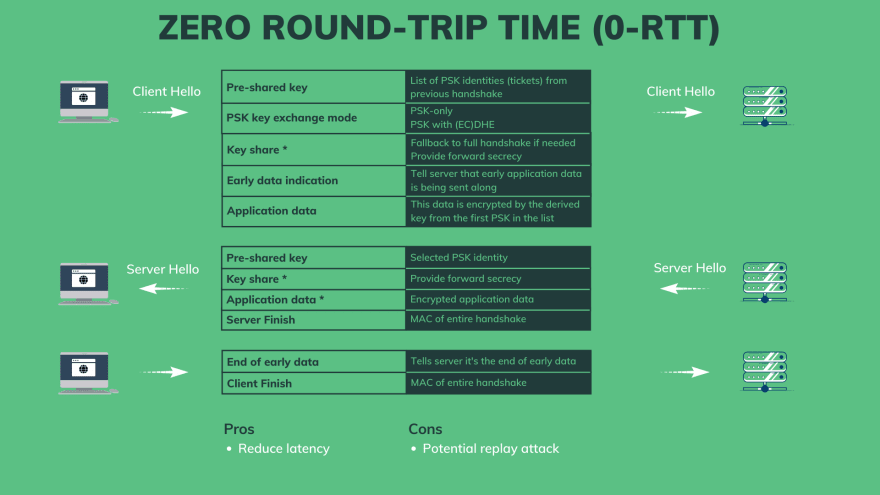
**Рисунок 26** - Нулевое время возобновления приёма-передачи — 0-RTT.

## Сравнение TLS 1.3 и TLS 1.2
Прежде чем закончить, давайте быстро сравним TLS 1.3 и TLS 1.2, чтобы узнать
о новинках. Во-первых, TLS 1.3 содержит более безопасные механизмы обмена 
ключами, в которых удалены уязвимые RSA и другие методы обмена статическими 
ключами. Остались только эфемерный алгоритм Диффи-Хеллмана или алгоритм
Диффи-Хеллмана на эллиптических кривых. Таким образом, достигается совершенная 
прямая секретность. Во-вторых, рукопожатие в TLS 1.3 как минимум на один цикл
приёма-передачи быстрее, чем в TLS 1.2. Симметричное шифрование в TLS 1.3 более 
безопасно, потому что набор шифров AEAD является обязательным, а также в нём
удалены некоторые алгоритмы из списка, которые легко взломать, например,
Block Cipher Mode, RC4 или Triple DES. Набор шифров в TLS 1.3 также проще, 
поскольку он содержит только алгоритм AEAD и хеширования. Алгоритмы обмена 
ключами и подписи вынесены в отдельные поля. Тогда как в TLS 1.2 они объединены
в набор шифров. Как мы видим на рисунке, DHE - это алгоритм обмена ключами, а
RSA - подписи. Из-за этого количество рекомендуемых наборов шифров становится 
слишком большим, 37 вариантов в TLS 1.2, если я правильно помню. В TLS 1.3 их
только 5. Кроме того, в TLS 1.3 криптографически более стойкая подпись, 
поскольку подписывается всё рукопожатие, а не его часть как в TLS 1.2. И 
наконец, что немаловажно, криптографии на эллиптической кривой уделяется 
значительное внимание в TLS 1.3, добавлено несколько улучшенных алгоритмов 
кривых, например, алгоритм цифровой подписи, основанный на эллиптической кривой
Эдвардса, который работает быстрее, не жертвуя безопасностью.

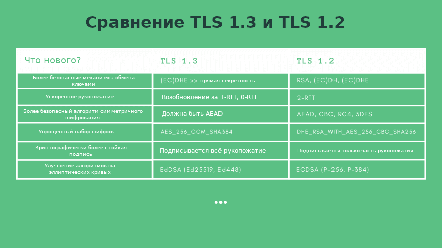
**Рисунок 27** - Сравнение TLS 1.3 и TLS 1.2.

Это всё о чём я хотел рассказать вам на этой лекции. Спасибо за время,
потраченное на чтение, и до новых встреч.