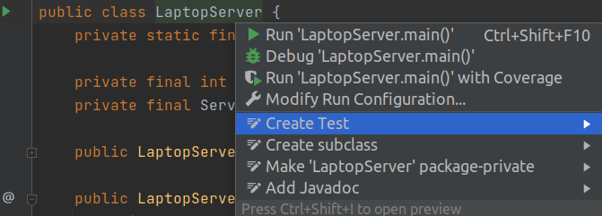
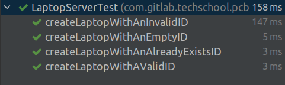

# Implement unary gRPC API - Java
Hello and welcome back to the gRPC course. In the first part of the lecture
we have learnt how to implement unary RPC in Go. In this second part, we will
learn how to do that in Java. The plan is the same. We will review how to 
define a service with protocol buffer, implement the server, the client with 
unit tests, and handle errors, status codes and deadline.

## Define a proto service and an unary RPC
OK, let's dive-in. I will open IntelliJ IDEA project, then open the terminal 
to copy the `laptop_service.proto` file, that we have written in the first part
to our Java project at `src/main/proto` folder. Alright, the file is here. I
will review its structure a bit for those who haven't read the lecture with
Go. First we have the `CreateLaptopRequest` message with a simple `Laptop` 
field.

```protobuf
message CreateLaptopRequest {
  Laptop laptop = 1;
}
```

Then we have the `CreateLaptopResponse` message with a string field, the 
laptop ID.

```protobuf
message CreateLaptopResponse {
  string id = 1;
}
```

Then we define the `LaptopService` with the `service` keyword. Inside that 
service we define our unary RPC with the `rpc` keyword. The name of the RPC is
`CreateLaptop`. It takes a `CreateLaptopRequest` as input and returns a 
`CreateLaptopResponse`. Very simple. Now let's build the project to generate
Java code from it. It throws an error: `javax.annotation.Generated`. To fix
this, we open the browser and search for "maven javax annotation". Open this
Javax Annotation API page `https://mvnrepository.com/artifact/javax.annotation/javax.annotation-api`
choose the latest version 1.3.2, copy this Gradle setting, and paste it in the
dependencies block of our `build.gradle` file. Wait a bit for Gradle to config
it.

```
dependencies {
    // ...
    
    // https://mvnrepository.com/artifact/javax.annotation/javax.annotation-api
    implementation group: 'javax.annotation', name: 'javax.annotation-api', version: '1.3.2'
}
```

## Generate codes for the unary RPC
Then click `Build` again. This time the build is successful.
Let's look at `build/generated/source/proto/main/grpc`. The `LaptopServiceGrpc`
class is generated here. Let's see what we have inside. First we have the
`LaptopServiceStub`.

```java
 /**
  * Creates a new async stub that supports all call types for the service
  */
  public static LaptopServiceStub newStub(io.grpc.Channel channel) {
    // ...
  }
```

This is an async stub that support all call types for the service. Then we 
have another blocking stub that supports unary and streaming output calls.

```java
 /**
  * Creates a new blocking-style stub that supports unary and streaming output calls on the service
  */
  public static LaptopServiceBlockingStub newBlockingStub(
     io.grpc.Channel channel){
     // ...
  }
```

We will use this blocking stub in this lecture. We also have a ListenableFuture
style stub. You can use it if you want to use future.

```java
 /**
  * Creates a new ListenableFuture-style stub that supports unary calls on the service
  */
  public static LaptopServiceFutureStub newFutureStub(
      io.grpc.Channel channel) {
    // ...
  }
```

Next is an abstract class `LaptopServiceImplBase`. We will have to implement 
the `createLaptop` function of this class on the server side.

```java
 /**
  */
  public static abstract class LaptopServiceImplBase implements io.grpc.BindableService {
    // ...
  }
```

There are several more things at the bottom of the file, but we don't have to 
care about them for now. So let's close these files and start coding.

## Implement the server's unary RPC handler
I will create a new "service" package `com.gitlab.techschool.pcbook.service`. 
On the server side, we create a new `LaptopService` class. We will have to write 
some logs, so let's declare a logger here. The `LaptopService` class must
extend the `LaptopServiceImplBase` class. We have to override the 
`createLaptop` function of this class. 

```java
public class LaptopService extends LaptopServiceGrpc.LaptopServiceImplBase {
    private static final Logger logger = Logger.getLogger(LaptopService.class.getName());

    @Override
    public void createLaptop(CreateLaptopRequest request, StreamObserver<CreateLaptopResponse> responseObserver) {
        
    }
}
```

First we get the input laptop object from the request. We get the ID of the 
laptop and write a simple log saying we've got a create-laptop request with 
this ID. Now we check if the Laptop ID is empty. Then we have to generate a 
random UUID for it. Else we will check if provided ID is a valid UUID or not.
If `UUID.fromString()` function throws an `IllegalArgumentException` then it 
is an invalid UUID. So we do a `try-catch` here. If we catch an error then we 
will return it to the client. Simply use the `responseObserver.onError` 
function here to return the `InvalidArgument` status together with a 
description message and convert it into a run-time exception. Then return 
right away. Otherwise, if everything goes well, we have a valid laptop ID at 
this step. We can safely set this ID to the laptop object like this. Here we
have to convert the laptop into a builder so that we can use the setter 
function to set the ID. OK, normally after this we have to save the laptop to
the database.

```java
public class LaptopService extends LaptopServiceGrpc.LaptopServiceImplBase {
    private static final Logger logger = Logger.getLogger(LaptopService.class.getName());

    @Override
    public void createLaptop(CreateLaptopRequest request, StreamObserver<CreateLaptopResponse> responseObserver) {
        Laptop laptop = request.getLaptop();

        String id = laptop.getId();
        logger.info("got a create-laptop request with ID: " + id);

        UUID uuid;
        if (id.isEmpty()) {
            uuid = UUID.randomUUID();
        } else {
            try {
                uuid = UUID.fromString(id);
            } catch (IllegalArgumentException e) {
                responseObserver.onError(
                        Status.INVALID_ARGUMENT
                                .withDescription(e.getMessage())
                                .asRuntimeException()
                );
                return;
            }
        }

        Laptop other = laptop.toBuilder().setId(uuid.toString()).build();
        // Save other laptop to the store
    }
}
```

## Implement in-memory storage to save laptops
However, I don't want you to be distracted since this is course
about gRPC, not about database. So I will just use in-memory storage. Let's
create a new file: `LaptopStore`. It should be an `Interface`, so that we can
easily implement different kinds of store whereever we want. This interface
will have a `Save` function to save a laptop to the store. Keep in mind that
for the simplicity of this lecture I use the probobuf `Laptop` object directly
as the data store model. But you should consider using a separate object model 
here to decouple between the data transfer and data storage layers. Alright,
we also need a `Find` function to search for a laptop by its ID.

```java
package com.gitlab.techschool.pcbook.service;

import com.github.techschool.pcbook.pb.Laptop;

public interface LaptopStore {
    void Save(Laptop laptop) throws Exception; // consider using a separate db model
    Laptop Find(String id);
}
```

Now let's create a new file to implement the `InMemoryLaptopStore`. We will 
use a `ConcurrentMap` to store the laptops, with the key is the laptop ID 
string, and the value is the laptop itself. In this constructor, we create a 
new `ConcurrentHashmap` with initial capacity of 0. In the `Save` function we 
check if the laptop ID is already in the store or not.

```java
package com.gitlab.techschool.pcbook.service;

import com.github.techschool.pcbook.pb.Laptop;

import java.util.concurrent.ConcurrentHashMap;
import java.util.concurrent.ConcurrentMap;

public class InMemoryLaptopStore implements LaptopStore {
    private ConcurrentMap<String, Laptop> data;

    public InMemoryLaptopStore() {
        data = new ConcurrentHashMap<>(0);
    }

    @Override
    public void Save(Laptop laptop) throws Exception {
        if (data.containsKey(laptop.getId())) {
            throw new AlreadyExistsException("laptop ID already exists");
        }
    }

    @Override
    public Laptop Find(String id) {
        return null;
    }
}
```

If it is we throw a new `AlreadyExistsException`. Let's define that exception 
in a separate file under `service` folder. It will extend the `RuntimeException` 
class and call super constructor with the input message.

```java
package com.gitlab.techschool.pcbook.service;

public class AlreadyExistsException extends RuntimeException {
    public AlreadyExistsException(String message) {
        super(message);
    }
}
```

OK, now in the `Save` laptop function, we will do a deep-copy of the laptop 
and save it to the hash map.

```java
public class InMemoryLaptopStore implements LaptopStore {
    // ...
    @Override
    public void Save(Laptop laptop) throws Exception {
        if (data.containsKey(laptop.getId())) {
            throw new AlreadyExistsException("laptop ID already exists");
        }

        // deep copy
        Laptop other = laptop.toBuilder().build();
        data.put(other.getId(), other);
    }

    // ...
}
```

In the `Find` function, if the map doesn't contain the laptop ID we just return 
`null`. Otherwise, we deep-copy the object from the map and return it.

```java
public class InMemoryLaptopStore implements LaptopStore {
    // ...

    @Override
    public Laptop Find(String id) {
        if (!data.containsKey(id)) {
            return null;
        }

        // deep copy
        Laptop other = data.get(id).toBuilder().build();
        return other;
    }
}
```

Alright let's go back to the `LaptopService`. We declare a `LaptopStore` 
object and initialize it from this constructor.

```java
public class LaptopService extends LaptopServiceGrpc.LaptopServiceImplBase {
    private static final Logger logger = Logger.getLogger(LaptopService.class.getName());

    private LaptopStore store;

    public LaptopService(LaptopStore store) {
        this.store = store;
    }
    
    // ...
}
```

Now in the `createLaptop` function we can call `store.Save()` to save the 
laptop to the store. If we catch an `AlreadyExistsException`, we will return
the `AlreadyExists` status to the client. Else if we catch an unexpected 
exception, we return the `Internal` status, which means internal server error. 
If there's no exception, we will create a new response object with the laptop
ID and return it to the client by using `responseObserver.onNext()` function. 
Finally, we call `onCompelted()` function to tell client, that the RPC is now 
completed and no more output will be sent. We write a simple log here saying 
that the laptop with this ID is successfully saved to the store. And that's it
for the `LaptopService` implementation.

```java
public class LaptopService extends LaptopServiceGrpc.LaptopServiceImplBase {
    // ...
    @Override
    public void createLaptop(CreateLaptopRequest request, StreamObserver<CreateLaptopResponse> responseObserver) {
        // ...

        // Save other laptop to the store
        try {
            store.Save(other);
        } catch (AlreadyExistsException e) {
            responseObserver.onError(
                    Status.ALREADY_EXISTS
                            .withDescription(e.getMessage())
                            .asRuntimeException()
            );
            return;
        } catch (Exception e) {
            responseObserver.onError(
                    Status.INTERNAL
                            .withDescription(e.getMessage())
                            .asRuntimeException()
            );
            return;
        }

        CreateLaptopResponse response = CreateLaptopResponse.newBuilder().setId(other.getId()).build();
        responseObserver.onNext(response);
        responseObserver.onCompleted();

        logger.info("saved laptop with ID: " + other.getId());
    }
}
```

Now let's create the `LaptopServer` class to listen to gRPC requests, and call
`LaptopService` to serve the requests. Similar as before, we first create a
new logger to write some logs. Then we will write 2 constructors. The first one
takes a port and a laptop store as input. And the second one will take 1 
additional input, which is the grpc `ServerBuilder`. This constructor will be
useful when we write the unit test later.

```java
public class LaptopServer {
    private static final Logger logger = Logger.getLogger(LaptopServer.class.getName());

    public LaptopServer(int port, LaptopStore store) {
        
    }

    public LaptopServer(ServerBuilder serverBuilder, int port, LaptopStore store) {
        
    }
}
```

In the first constructor we create a new server builder for the input port, 
then call the second constructor with it. We define 2 private fields in the
`LaptopServer` class, one for the port and the other for the gRPC server. In
the second constructor we save the input port to the class, we create a laptop
service with the input store. Add the laptop service to the server builder and
call the `build()` function to make a gRPC server.

```java
public class LaptopServer {
    private static final Logger logger = Logger.getLogger(LaptopServer.class.getName());

    private final int port;
    private final Server server;

    public LaptopServer(int port, LaptopStore store) {
        this(ServerBuilder.forPort(port), port, store);
    }

    public LaptopServer(ServerBuilder serverBuilder, int port, LaptopStore store) {
        this.port = port;
        LaptopService laptopService = new LaptopService(store);
        server = serverBuilder.addService(laptopService).build();
    }
}
```

Next we write a `start()` function to start the server. We write a log here 
saying that the server is started on this `port`. Then we need a `stop()` 
function to shutdown the server. We use the `awaitTermination()` function here
to wait until the server is completely terminated. As sometimes the JVM might
be terminated externally due to some interrupts or unexpected errors, we 
should add a shutdown hoot to the `start()` function, so that the gRPC server
can be gracefully shut down. In this hook, we just write a log to the system
error and call the `stop()` function of the `LaptopServer` object.

```java
public class LaptopServer {
    // ...
    
    public void start() throws IOException {
        server.start();
        logger.info("server started on port " + port);

        Runtime.getRuntime().addShutdownHook(new Thread() {
            @Override
            public void run() {
                System.out.println("shut down gRPC server because JVM shuts down");
                try {
                    LaptopServer.this.stop();
                } catch (InterruptedException e) {
                    e.printStackTrace(System.err);
                }
                System.err.println("server shut down");
            }
        });
    }

    public void stop() throws InterruptedException {
        if (server != null) {
            server.shutdown().awaitTermination(30, TimeUnit.SECONDS);
        }
    }
}
```

Next we write one more function to block the main thread until the server 
shuts down because the gRPC server uses daemon threads. 

```java
public class LaptopServer {
    // ...

    private void blockUntilShutdown() throws InterruptedException {
        if (server != null) {
            server.awaitTermination();
        }
    }
}
```

Alright, now we can write the `main` function. First we create a new 
`InMemoryLaptopStore`. Then we create a new LaptopServer on port 8080 with
that store. We call `server.start()` to start the server and finally call 
`server.blockUntilShutdown()`. Now the server is ready.

```java
public class LaptopServer {
    // ...
    
    public static void main(String[] args) throws InterruptedException, IOException {
        InMemoryLaptopStore store = new InMemoryLaptopStore();
        LaptopServer server = new LaptopServer(8080, store);
        server.start();
        server.blockUntilShutdown();
    }
}
```

Let's click this `Run` button near `public static void main` to run it. As you 
can see, the server is started on port 8080. Now I will use the Golang client 
that we have written in the previous lecture to connect to this server. I will
run `make client` in the terminal to start the client. Yee, the laptop is 
created with this ID.

```shell
2021/04/01 19:28:18 created laptop with id: fa63a094-834d-46c4-be1d-e4f334f4be84
```

On the server side, we also see a log saying that it has received a 
create-laptop request with empty ID, and another log saying that the laptop
is saved to the store.

```shell
INFO: got a create-laptop request with ID: 
INFO: saved laptop with ID: fa63a094-834d-46c4-be1d-e4f334f4be84
```

However, you may encounter with a "transport failed" message after that. It's 
not an error, since the log is at INFO level. When I search for this on the 
web, it looks like this is a new bug of the gRPC-java library when the client 
closes the connection too fast, and the RPC call is not fully completed. 
Although the response has successfully been delivered. The server still logs
this message at the INFO level, while it should be at FINE level. The pull 
request to fix this has been merged recently so I hope it would be OK in the 
next release. For now there's a quick fix. After receiving the response from
the server we can just sleep a bit, let's say 1 second.

`cmd/client/main.go`
```go
func main() {
	log.Printf("created laptop with id: %s", res.Id)
	time.Sleep(time.Second)
}
```

Then when we run `make client` again, we won't see the failed message any more.
Next let's try the case when the ID is already generated on client side.

`cmd/client/main.go`
```go
func main() {
    // ...
	
    laptop := sample.NewLaptop()
    //laptop.Id = ""
    req := &pb.CreateLaptopRequest{
        Laptop: laptop,
    }
    
    // ...
}
```

It worked! As we can see on the server logs, the laptop is created successfully 
with the ID that client sent in the request. Now let's try the case where 
laptop ID already exists.

`cmd/client/main.go`
```go
func main() {
    // ...
	
    laptop := sample.NewLaptop()
    laptop.Id = "fa63a094-834d-46c4-be1d-e4f334f4be84"
    req := &pb.CreateLaptopRequest{
        Laptop: laptop,
    }
    
    // ...
}
```

Cool! It says the laptop already exists, exactly as we expected.

```shell
2021/04/01 19:44:14 laptop already exists
```

How about the invalid ID case?

`cmd/client/main.go`
```go
func main() {
    // ...
	
    laptop := sample.NewLaptop()
    laptop.Id = "invalid"
    req := &pb.CreateLaptopRequest{
        Laptop: laptop,
    }
    
    // ...
}
```

The `InvalidArgument` error code is returned.

```shell
2021/04/01 19:46:43 cannot create laptop: rpc error: code = InvalidArgument desc = Invalid UUID string: invalid
exit status 1
```

Great!
Now let's learn how to write the client in Java. I will create a new 
`LaptopClient` class in the `service` package. As usual, we create a new logger.
Then the constructor will have 2 arguments: the server `host` and `port`. To 
connect to the server, we need a managed channel object. It's like a 
connection between the client and the server. We also need a blocking stub in
order to call the unary RPC.

```shell
import com.github.techschool.pcbook.pb.LaptopServiceGrpc;
import io.grpc.ManagedChannel;

import java.util.logging.Logger;

public class LaptopClient {
    private static final Logger logger = Logger.getLogger(LaptopClient.class.getName());

    private final ManagedChannel channel;
    private final LaptopServiceGrpc.LaptopServiceBlockingStub blockingStub;

    public LaptopClient(String host, int port) {

    }
}
```

In the `LaptopClient` constructor we use `ManagedChannelBuilder` to build the 
channel with the specified server `host` and `port`. For simplicity, we don't
use a secure connection yet. So let's just use plaintext for now. After 
building the channel, we can use it to create a new blocking stub.

```java
public class LaptopClient {
    // ...

    public LaptopClient(String host, int port) {
        channel = ManagedChannelBuilder.forAddress(host, port)
                .usePlaintext()
                .build();

        blockingStub = LaptopServiceGrpc.newBlockingStub(channel);
    }
}
```

Now we write a shutdown function to gracefully shutdown the channel. We will
wait for the channel to terminate for at most 5 seconds.

```java
public class LaptopClient {
    // ...
    
    public void shutdown() throws InterruptedException {
        channel.shutdown().awaitTermination(5, TimeUnit.SECONDS);
    }
}
```

Next we will write `createLaptop` function to call the RPC on the server to
create a new laptop. First we build a new create-laptop request with the input
laptop object. We make a default create-laptop response instance, then call 
`blockStub.createlaptop()` and pass in the request. If we catch an exception, 
we write a severe log message and return. If the call is successful, a response
will be returned. We write an info log saying the laptop is created with this
ID.

```java
public class LaptopClient {
    // ...
    
    public void createLaptop(Laptop laptop) {
        CreateLaptopRequest request = CreateLaptopRequest.newBuilder().setLaptop(laptop).build();
        CreateLaptopResponse response = CreateLaptopResponse.getDefaultInstance();
        try {
            response = blockingStub.createLaptop(request);
        } catch (Exception e) {
            logger.log(Level.SEVERE, "request failed: " + e.getMessage());
            return;
        }
        
        logger.info("laptop created with ID: " + response.getId());
    }
}
```

Alright now type `psvm` to create the main function. First create a new laptop
client that connects to `localhost` at port `8080`. Make a new laptop generator 
and generate a random laptop.

```java
public class LaptopClient {
    // ...

    public static void main(String[] args) {
        LaptopClient client = new LaptopClient("0.0.0.0", 8080);

        Generator generator = new Generator();
        Laptop laptop = generator.NewLaptop();
        
    }
}
```

By the way, in lecture 9 I forgot to set a random
ID for the laptop object. So let's call `setID()` function here in 
`NewLaptop()` to set it value to a random UUID string.

```java
public class Generator {
    // ...
    
    public Laptop NewLaptop() {
        // ...

        return Laptop.newBuilder()
                .setId(UUID.randomUUID().toString())
                .setBrand(brand)
                .setName(name)
                .setCpu(NewCPU())
                .setRam(NewRAM())
                .addGpus(NewGPU())
                .addStorages(NewSSD())
                .addStorages(NewHDD())
                .setScreen(NewScreen())
                .setKeyboard(NewKeyboard())
                .setWeightKg(weightKg)
                .setPriceUsd(priceUsd)
                .setReleaseYear(releaseYear)
                .setUpdatedAt(timestampNow())
                .build();
    }

    // ...
}
```

Back to our main function, now we can call `client.createLaptop` with the
random laptop object. Surround it with a `try` block and `finally` call 
`client.shutdown()` to terminate it clearly.

```java
public class LaptopClient {
    // ...

    public static void main(String[] args) throws InterruptedException {
        // ...

        try {
            client.createLaptop(laptop);
        } finally {
            client.shutdown();
        }
    }
}
```

OK, now let's run server implemented in Go and connect this Java client to it.
The laptop is successfully created.

```shell
INFO: laptop created with ID: 7fea0409-cffb-4b61-bac1-5b81111730e7
```

Let's try the case where the client sends an empty laptop ID.

```java
public class LaptopClient {
    // ...

    public static void main(String[] args) throws InterruptedException {
        // ...

        Generator generator = new Generator();
        Laptop laptop = generator.NewLaptop().toBuilder().setId("").build();

        // ...
    }
}
```

A laptop is still created.

```shell
INFO: laptop created with ID: 4a24b183-64da-42b4-8a5b-557912351a30
```

On the server side, there are 2 logs, 1 log with empty ID, and the other with
a random UUID.

```shell
2021/04/01 20:35:32 receive a create-laptop request with id: 
2021/04/01 20:35:38 saved laptop with id: 4a24b183-64da-42b4-8a5b-557912351a30
```

That's exactly what we want. Now if we try to send an ID that already exists,
the server will return an error with `ALREADY_EXISTS` status.

```java
public class LaptopClient {
    // ...

    public static void main(String[] args) throws InterruptedException {
        // ...

        Generator generator = new Generator();
        Laptop laptop = generator.NewLaptop().toBuilder().setId("4a24b183-64da-42b4-8a5b-557912351a30").build();

        // ...
    }
}
```

```shell
SEVERE: request failed: ALREADY_EXISTS: cannot save laptop to the store: record already exists
```

However, it's showing as a severe log, while we only want this to be a normal 
info log. So let's update the code a little bit. Here if we catch a 
`StatusRuntimeException` we can call `e.getStatus().getCode()` to get the 
status code of the response. If it is `AlreadyExists`, then it's not a big 
deal. We just write a simple info log here and return. Else we write a severe
log just like other exceptions.

```java
public class LaptopClient {
    // ...

    public void createLaptop(Laptop laptop) {
        // ...

        try {
            response = blockingStub.createLaptop(request);
        } catch (StatusRuntimeException e) {
            if (e.getStatus().getCode() == Status.Code.ALREADY_EXISTS) {
                // not a big deal
                logger.info("laptop ID already exists");
                return;
            }
            logger.log(Level.SEVERE, "request failed: " + e.getMessage());
            return;
        } catch (Exception e) {
            logger.log(Level.SEVERE, "request failed: " + e.getMessage());
            return;
        }
        
        // ...
    }
}
```

Now the log is an info "laptop ID already exists".

```shell
INFO: laptop ID already exists
```

If we change the ID to "invalid" and re-run the client. There will be a severe
log with an `Invalid Argument` status code.

```shell
SEVERE: request failed: INVALID_ARGUMENT: laptop ID is not a valid UUID: invalid UUID length: 7
```

So the Java client is working very well with the Go server.
Now let's try it one more time with the Java server. The server is started on
port 8080. Now let's run the client with empty ID. The laptop is created.

```shell
INFO: laptop created with ID: 17877dd3-0f15-4087-9905-56e3eae8aa60
```

Now the existed-ID case. The laptop ID already exists.

```shell
INFO: laptop ID already exists
```

Then the invalid ID case. Request failed, invalid argument.

```shell
SEVERE: request failed: INVALID_ARGUMENT: Invalid UUID string: invalid
```

And finally the case with a valid ID. The laptop is created.

```shell
INFO: laptop created with ID: 823095af-7bc0-4bfd-8d71-15651bf5e178
```

Alright, so the Java client is also working perfectly with the Java server.
Now I will show you how to handle request timeout. Let's say on the server we
do some heavy processing before saving the laptop to the store. I will use a
simple sleep for 6 seconds here.

```java
public class LaptopService extends LaptopServiceGrpc.LaptopServiceImplBase {
    // ...
    @Override
    public void createLaptop(CreateLaptopRequest request, StreamObserver<CreateLaptopResponse> responseObserver) {
        // ...

        // heavy processing
        try {
            TimeUnit.SECONDS.sleep(6);
        } catch (InterruptedException e) {
            e.printStackTrace();
        }
        
        // ...
    }
}
```

Then on the client side, we set the deadline of the request to be 5 seconds.

```java
public class LaptopClient {
    // ...
    public void createLaptop(Laptop laptop) {
        // ...

        try {
            response = blockingStub.withDeadlineAfter(5, TimeUnit.SECONDS).createLaptop(request);
        } catch (StatusRuntimeException e) {
            if (e.getStatus().getCode() == Status.Code.ALREADY_EXISTS) {
                // not a big deal
                logger.info("laptop ID already exists");
                return;
            }
            logger.log(Level.SEVERE, "request failed: " + e.getMessage());
            return;
        } catch (Exception e) {
            logger.log(Level.SEVERE, "request failed: " + e.getMessage());
            return;
        }
        
        // ...
    }
}
```

Now run the server and run the client. After 5 seconds, we get deadline 
exceeded error. 

```shell
SEVERE: request failed: DEADLINE_EXCEEDED: deadline exceeded after 4.984459972s. [buffered_nanos=141896411, remote_addr=0.0.0.0/[0:0:0:0:0:0:0:1]:8080]
```

However, on the server side, the laptop is still getting created.

```shell
INFO: saved laptop with ID: 947bd987-5a1d-4fcc-8178-ecc10ec0aa9e
```

Let's go back to the server to fix this. After the heavy processing, we will
check the current context status. If it is cancelled, we write a simple info
log here. Call `responseObserver.onError()` with status cancelled and return
immediately.

```java
public class LaptopService extends LaptopServiceGrpc.LaptopServiceImplBase {
    // ...
    @Override
    public void createLaptop(CreateLaptopRequest request, StreamObserver<CreateLaptopResponse> responseObserver) {
        // ...

        // heavy processing
        try {
            TimeUnit.SECONDS.sleep(6);
        } catch (InterruptedException e) {
            e.printStackTrace();
        }
        
        if (Context.current().isCancelled()) {
            logger.info("request is cancelled");
            responseObserver.onError(
                    Status.CANCELLED
                            .withDescription("request is cancelled")
                            .asRuntimeException()
            );
            return;
        }
        
        // ...
    }
}
```

Now if we restart the server and re-run the client. This time, there is a log
on the server saying "request is cancelled" and the laptop is not saved to 
the store any more.

```shell
INFO: request is cancelled
```

Perfect! Now before I show you how to write unit tests for this unary RPC, I
will comment out this heavy processing block.

## Test the unary RPC handler
OK, on this laptop sever class we press option + Enter (on macOS) or Alt + 
Enter (on Win or Linux) and select "Create Test".



**Picture 1** - Create test.

Choose the `setUp` and `tearDown` checkbox and click OK. The test file will be
generated in the `com/gitlab/techschool/pcbook/service folder`. In the `setUp` 
function we will generate a server name, and create a new in-process server
builder with that name, as a direct executor.

```java
public class LaptopServerTest {

    @Before
    public void setUp() throws Exception {
        String serverName = InProcessServerBuilder.generateName();
        InProcessServerBuilder serverBuilder = InProcessServerBuilder.forName(serverName).directExecutor();
    }

    @After
    public void tearDown() throws Exception {
    }
}
```

Next we declare 3 private objects: a laptop store, a laptop server and a 
managed channel.

```java
public class LaptopServerTest {

    private LaptopStore store;
    private LaptopServer server;
    private ManagedChannel channel;

    // ...
}
```

In the `setUp` function we initialize the store as an in-memory laptop store.
We create the server with the server builder, port 0, and the laptop store.
Call `server.start()` and finally we create the channel as an in-process 
channel. For the generated server name also as a direct executor. We also
want to clean up the connection after the test. So we will add a gRPC clean-up
rule here, and register the channel with it in the test `setUp` function.

```java
public class LaptopServerTest {
    @Rule
    public final GrpcCleanupRule grpcCleanup = new GrpcCleanupRule(); // automatic shutdown channel at the end of test

    // ...

    @Before
    public void setUp() throws Exception {
        // ...

        store = new InMemoryLaptopStore();
        server = new LaptopServer(serverBuilder, 0, store);
        server.start();

        channel = grpcCleanup.register(
                InProcessChannelBuilder.forName(serverName).directExecutor().build()
        );
    }
    
    // ...
}
```

In the `tearDown` function, all we have to do is to call `server.stop()`.

```java
public class LaptopServerTest {
    // ...

    @After
    public void tearDown() throws Exception {
        server.stop();
    }
}
```

OK now let's write the first test. It will test the createLaptop RPC with a 
valid laptop ID. First we create a new laptop generator, and generate a random
laptop object. Then we build a create-laptop request with the generated
laptop. We create a new blocking stub with the managed channel that we have 
build in the `setUp` function. Then we use the stub to call `createLaptop` 
with the request object. The server will return a response. We assert that the
response is not null and that the response ID should be equal to the input 
laptop ID. Finally if we find the ID in the store, then it should be found,
or not null. OK, let's run this test.

```java
public class LaptopServerTest {
    // ...
    
    @Test
    public void createLaptopWithAValidID() {
        Generator generator = new Generator();
        Laptop laptop = generator.NewLaptop();
        CreateLaptopRequest request = CreateLaptopRequest.newBuilder().setLaptop(laptop).build();

        LaptopServiceGrpc.LaptopServiceBlockingStub stub = LaptopServiceGrpc.newBlockingStub(channel);
        CreateLaptopResponse response = stub.createLaptop(request);
        assertNotNull(response);
        assertEquals(laptop.getId(), response.getId());

        Laptop found = store.Find(response.getId());
        assertNotNull(found);
    }
}
```

It passed. Now I will duplicate this test and change it for the 2nd case. This
is gonna be the case with an empty ID. So here I will convert the laptop to a
builder. Set ID to an empty string, and rebuild it. Now if we run this test, 
it failed because we're still expecting the created laptop ID to be equal to
the input laptop ID.

```java
public class LaptopServerTest {
    // ...
    @Test
    public void createLaptopWithAnEmptyID() {
        Generator generator = new Generator();
        Laptop laptop = generator.NewLaptop().toBuilder().setId("").build();
        CreateLaptopRequest request = CreateLaptopRequest.newBuilder().setLaptop(laptop).build();

        LaptopServiceGrpc.LaptopServiceBlockingStub stub = LaptopServiceGrpc.newBlockingStub(channel);
        CreateLaptopResponse response = stub.createLaptop(request);
        assertNotNull(response);
        assertEquals(laptop.getId(), response.getId()); // response laptop ID not equal to the input laptop ID.

        Laptop found = store.Find(response.getId());
        assertNotNull(found);
    }
}
```

So let's change this assert command to just check that the response ID is not
empty. Now the test passed.

```java
public class LaptopServerTest {
    // ...
    @Test
    public void createLaptopWithAnEmptyID() {
        // ...
        assertFalse(response.getId().isEmpty());

        Laptop found = store.Find(response.getId());
        assertNotNull(found);
    }
}
```

The third case is when client sends an invalid ID. Here I will just change 
this laptop ID to "invalid" and assert that the response ID is null. The 
most important thing is: we expect to catch a `StatusRuntimeException` in this
case. Alright, let's run the test.

```java
public class LaptopServerTest {
    // ...
    @Test(expected = StatusRuntimeException.class)
    public void createLaptopWithAnInvalidID() {
        Generator generator = new Generator();
        Laptop laptop = generator.NewLaptop().toBuilder().setId("invalid").build();
        CreateLaptopRequest request = CreateLaptopRequest.newBuilder().setLaptop(laptop).build();

        LaptopServiceGrpc.LaptopServiceBlockingStub stub = LaptopServiceGrpc.newBlockingStub(channel);
        CreateLaptopResponse response = stub.createLaptop(request);
        assertNotNull(response);
        assertNull(response.getId());
    }
}
```

Actually I think the response might be null too.

```java
public class LaptopServerTest {
    // ...
    @Test(expected = StatusRuntimeException.class)
    public void createLaptopWithAnInvalidID() {
        Generator generator = new Generator();
        Laptop laptop = generator.NewLaptop().toBuilder().setId("invalid").build();
        CreateLaptopRequest request = CreateLaptopRequest.newBuilder().setLaptop(laptop).build();

        LaptopServiceGrpc.LaptopServiceBlockingStub stub = LaptopServiceGrpc.newBlockingStub(channel);
        CreateLaptopResponse response = stub.createLaptop(request);
        assertNull(response);
        assertNull(response.getId());
    }
}
```

The test still passed. So it looks like the assert command is not executed 
after the exception caught, and we can delete it.

```java
public class LaptopServerTest {
    // ...
    @Test(expected = StatusRuntimeException.class)
    public void createLaptopWithAnInvalidID() {
        Generator generator = new Generator();
        Laptop laptop = generator.NewLaptop().toBuilder().setId("invalid").build();
        CreateLaptopRequest request = CreateLaptopRequest.newBuilder().setLaptop(laptop).build();

        LaptopServiceGrpc.LaptopServiceBlockingStub stub = LaptopServiceGrpc.newBlockingStub(channel);
        CreateLaptopResponse response = stub.createLaptop(request);
    }
}
```

Now the last case: client sends an ID that already exists. Here I will generate
a normal random laptop and save it to the store before making the request. This
case we also expect to catch a `StatusRuntimeException`. So there's nothing
more to be changed. Let's run the test.

```java
public class LaptopServerTest {
    // ...
    @Test(expected = StatusRuntimeException.class)
    public void createLaptopWithAnAlreadyExistsID() throws Exception{
        Generator generator = new Generator();
        Laptop laptop = generator.NewLaptop();
        store.Save(laptop);
        CreateLaptopRequest request = CreateLaptopRequest.newBuilder().setLaptop(laptop).build();

        LaptopServiceGrpc.LaptopServiceBlockingStub stub = LaptopServiceGrpc.newBlockingStub(channel);
        CreateLaptopResponse response = stub.createLaptop(request);
    }
}
```

It passed. Now let's run all unit tests together. There are 4 green ticks here,
so they all passed. Excellent!



**Picture 2** - All tests passed.

And that's the end of this lecture. Now you know how to implement and test 
the unary RPC in both Go and Java.

In the next lecture, we will learn how to implement the 2nd type of gRPC
which is server-streaming. I hope the course is useful for you. Happy coding,
and see you later!