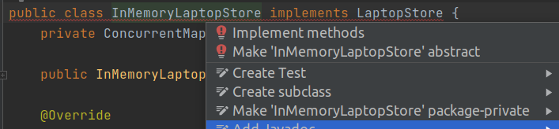

# Реализация серверного потокового gRPC API - Java
Здравствуйте, рад снова видеть вас на gRPC курсе. На этой лекции мы узнаем как
реализовать серверный потоковый RPC в Java. Этот RPC позволит нам искать 
ноутбуки, используя определенные фильтрующие условия. Результат будет возвращён
клиенту в виде потока объектов.

## Добавляем описание серверного потокового RPC в Protobuf
Итак, давайте начнём! Я открою проект в IntelliJ IDEA, над которым мы работали
в предыдущих лекциях. Поскольку мы уже определили RPC для поиска ноутбуков на 
предыдущей лекции я просто перейду в Golang проект `pcbook` и скопирую 2 proto 
файла в наш Java проект. Сначала файл `filter_message.proto`, а затем 
`laptop_service.proto`. После копирования проведём краткий обзор их 
содержимого. Сообщение `Filter` позволяет нам задать некую конфигурацию 
ноутбука, которую мы хотим найти. В файле `laptop_service.proto` содержится
`SearchLaptopRequest` куда передаётся фильтр, а в `SearchLaptopResponse` - 
объект-ноутбук. Мы задаём серверный потоковый RPC, который принимает на вход
`SearchLaptopRequest` и возвращает поток из `SearchLaptopResponse`.

Теперь давайте соберём проект для генерации Java кода. Сборка должна пройти
успешно. Посмотрим на сгенерированный код. Как видно в этом классе 
`LaptopServiceImplBase` создан новый метод `searchLaptop`, который мы должны
реализовать на стороне сервера. Также в классе `LaptopServiceBlockingStub`
есть метод `searchLaptop`, который мы можем использовать на стороне клиента
для вызова сервера. Он вернет итератор объекта `SearchLaptopResponse`.

```java
/**
 */
public static abstract class LaptopServiceImplBase implements io.grpc.BindableService {
    // ...
    /**
     */
    public void searchLaptop(com.github.techschool.pcbook.pb.SearchLaptopRequest request,
                             io.grpc.stub.StreamObserver<com.github.techschool.pcbook.pb.SearchLaptopResponse> responseObserver) {
        io.grpc.stub.ServerCalls.asyncUnimplementedUnaryCall(getSearchLaptopMethod(), responseObserver);
    }
    
    // ...
}

/**
 */
public static final class LaptopServiceBlockingStub extends io.grpc.stub.AbstractBlockingStub<LaptopServiceBlockingStub> {
    // ...
    /**
     */
    public java.util.Iterator<com.github.techschool.pcbook.pb.SearchLaptopResponse> searchLaptop(
            com.github.techschool.pcbook.pb.SearchLaptopRequest request) {
        return io.grpc.stub.ClientCalls.blockingServerStreamingCall(
                getChannel(), getSearchLaptopMethod(), getCallOptions(), request);
    }
}
```

Прежде всего мы реализуем серверную часть. Давайте начнём с интерфейса 
`LaptopStore`. Мы определим новый метод `Search`, который принимает фильтр в 
качестве входного параметра и присылает обратно подходящие ноутбуки, используя
параметр `LaptopStream`. Это поток определяется как функциональный интерфейс с 
только одним методом: `Send`. Так что вы можете использовать его как лямбду,
если хотите. Я перенесу этот интерфейс в отдельный файл.

`com/gitlab/techschool/pcbook/service/LaptopStore.java`
```java
package com.gitlab.techschool.pcbook.service;

import com.github.techschool.pcbook.pb.Filter;
import com.github.techschool.pcbook.pb.Laptop;

public interface LaptopStore {
    void Save(Laptop laptop) throws Exception; // consider using a separate db model
    Laptop Find(String id);
    void Search(Filter filter, LaptopStream stream);
}
```
`com/gitlab/techschool/pcbook/service/LaptopStream.java`
```java
package com.gitlab.techschool.pcbook.service;

import com.github.techschool.pcbook.pb.Laptop;

public interface LaptopStream {
    void Send(Laptop laptop);
}
```

## Добавляем функцию поиска в хранилище в памяти
После этого мы должны реализовать функцию `Search` для `InMemoryLaptopStore`.
В IntelliJ IDEA нажмите Option + Enter (на macOS) или Alt + Enter (на Win и 
Linux), находясь курсором на имени класса и выберите пункт меню
`Implement methods`.



**Рисунок 1** - Реализуем метод Search.

В этом методе `Search` мы используем цикл `for` для перебора всех элементов 
карты данных. Значением переменной `entry` будет ноутбук. Мы проверяем 
соответствует или нет ноутбук характеристикам, указанным в фильтре. Если да,
то мы просто вызываем `stream.Send()` и отправляем глубокую копию ноутбука
вызывающему.

```java
public class InMemoryLaptopStore implements LaptopStore {
    // ...
    @Override
    public void Search(Filter filter, LaptopStream stream) {
        for (Map.Entry<String, Laptop> entry: data.entrySet()) {
            Laptop laptop = entry.getValue();
            if (isQualified(filter, laptop)) {
                stream.Send(laptop.toBuilder().build());
            }
        }
    }
}
```

Отлично, давайте теперь реализуем функцию `isQualified()`. Во-первых, если
цена ноутбука больше максимальной цены, указанной в фильтре, вернём `false`.
Если количество ядер ноутбука меньше, чем требует фильтр, вернём `false`. Если
минимальная частота ЦПУ ноутбука меньше, чем указана в фильтре, вернём `false`.
И, наконец, если объём ОЗУ меньше, чем задано в фильтре, вернём `false`.

```java
public class InMemoryLaptopStore implements LaptopStore {   
    // ...
    private boolean isQualified(Filter filter, Laptop laptop) {
        if (laptop.getPriceUsd() > filter.getMaxPriceUsd()) {
            return false;
        }
        
        if (laptop.getCpu().getNumberCores() < filter.getMinCpuCores()) {
            return false;
        }
        
        if (laptop.getCpu().getMinGhz() < filter.getMinCpuGhz()) {
            return false;
        }
        
        if (toBit(laptop.getRam()) < toBit(filter.getMinRam())) {
            return false;
        }
        
        return true;
    }
}
```

Здесь нам нужно создать функцию `toBit()`, которая преобразуем объём памяти к
наименьшей единице измерения: биту (`BIT`). В этой функции мы сначала получаем
числовое значение объёма памяти. Затем мы используем оператор switch-case для
единиц измерения памяти. Если она равна `BIT`, то просто возвращаем значение.
Если `BYTE`, то возвращаем значение сдвинутое влево на 3, так как 1 байт равен 
8 бит, а 8 - это 2 в степени 3. Если единица измерения памяти равна килобайт 
(`KILOBYTE`), то возвращаем значение сдвинутое влево на 13, поскольку 1 
килобайт равен 1024 (или 2 в 10 степени) байт, что равно 2 в 13 степени бит.
По аналогии, для мегабайта возвращаем значение сдвинутое влево на 23, для 
гигабайта — на 33, для терабайта — на 43. Для случая по умолчанию просто 
вернём 0.

```java
public class InMemoryLaptopStore implements LaptopStore {
    // ...
    private long toBit(Memory memory) {
        long value = memory.getValue();

        switch (memory.getUnit()) {
            case BIT:
                return value;
            case BYTE:
                return value << 3; // 1 BYTE = 8 BIT = 2^3 BIT
            case KILOBYTE:
                return value << 13; // 1 KILOBYTE = 1024 BYTE = 2^10 BYTE = 2^13 BIT
            case MEGABYTE:
                return value << 23;
            case GIGABYTE:
                return value << 33;
            case TERABYTE:
                return value << 43;
            default:
                return 0;
        }
    }
}
```

Итак, метод для поиска в хранилище реализован.

## Реализуем сервер
Давайте откроем файл `LaptopService`. Мы должны переопределить функцию
`searchLaptop()`. Сначала получаем значение фильтра из запроса. Пишем сообщение
в лог о том, что был получен запрос на поиск ноутбука со следующими значениями 
фильтра. Затем мы вызываем функцию `store.Search()`, передав в неё фильтр и 
реализацию интерфейса `LaptopStream`. Если ноутбук будет найден, мы получим его
с помощью функции `Send`. Затем мы записываем сообщение в лог о том, что был 
найден ноутбук с определенным идентификатором. После этого создаём ответ от 
сервера с этим ноутбуком и вызываем функцию `responseObserver.onNext()`, чтобы
отправить этот ответ клиенту. В конце, когда поиск завершён, мы используем 
функцию `responseObserver.onCompleted`. Она сообщает клиенту, что ответов от 
сервера больше не будет. Давайте также добавим сообщение в лог об успешном 
завершении поиска.

```java
public class LaptopService extends LaptopServiceGrpc.LaptopServiceImplBase {
    // ...
    @Override
    public void searchLaptop(SearchLaptopRequest request, StreamObserver<SearchLaptopResponse> responseObserver) {
        Filter filter = request.getFilter();
        logger.info("got a search-laptop request with filters: \n" + filter);

        store.Search(filter, new LaptopStream() {
            @Override
            public void Send(Laptop laptop) {
                logger.info("found laptop with ID: " + laptop.getId());
                SearchLaptopResponse response = SearchLaptopResponse.newBuilder().setLaptop(laptop).build();
                responseObserver.onNext(response);
            }
        });

        responseObserver.onCompleted();
        logger.info("search laptop completed");
    }
}
```

## Реализуем клиент
Сервер реализован, теперь давайте напишем клиент. Здесь в функции `main` файла
`LaptopClient.java` я буду использовать цикл `for` для создания 10 случайных 
ноутбуков. Затем инициализируем фильтр с максимальной ценой в 3000$, 
минимальным количеством ядер равным 4, минимальной частотой процессора 2,5 ГГц,
и минимальным объёмом ОЗУ в 8 Гб. После создания фильтра мы можем передать 
его в функцию `searchLaptop()`.

```java
public class LaptopClient {
    public static void main(String[] args) throws InterruptedException {
        // ...

        try {
            for (int i = 0; i < 10; i++) {
                Laptop laptop = generator.NewLaptop();
                client.createLaptop(laptop);
            }

            Memory minRam = Memory.newBuilder()
                    .setValue(8)
                    .setUnit(Memory.Unit.GIGABYTE)
                    .build();

            Filter filter = Filter.newBuilder()
                    .setMaxPriceUsd(3000)
                    .setMinCpuCores(4)
                    .setMinCpuGhz(2.5)
                    .setMinRam(minRam)
                    .build();

            client.searchLaptop(filter);
        } finally {
            client.shutdown();
        }
    }
}
```

В этой функции давайте добавим сообщение в лог о начале поиска. Мы создадим 
новый `SearchLaptopRequest` с этим фильтром. Затем мы воспользуемся 
`blockingStub`, чтобы вызвать `searchLaptop()` RPC на сервере, передавая 
созданный запрос. Он вернет итератор из объектов `SearchLaptopResponse`. Всё 
что нам нужно сделать — это перебрать все значения этого итератора в цикле и 
для каждого объекта-ответа записать в лог сообщение, содержащее идентификатор 
ноутбука. Прежде чем завершить выполнение метода, мы добавляем в лог сообщение
о завершении поиска. Код, необходимый для реализации клиента, написан.

```java
public class LaptopClient {
    // ...
    
    private void searchLaptop(Filter filter) {
        logger.info("search started");
        
        SearchLaptopRequest request = SearchLaptopRequest.newBuilder().setFilter(filter).build();
        Iterator<SearchLaptopResponse> responseIterator = blockingStub.searchLaptop(request);
        
        while (responseIterator.hasNext()) {
            SearchLaptopResponse response = responseIterator.next();
            Laptop laptop = response.getLaptop();
            logger.info("- found: " + laptop.getId());
        }

        logger.info("search completed");
    }
}
```

Давайте запустим gRPC и клиент. Всё работает! Было найдено и отображено в логах
на стороне клиента несколько ноутбуков.

```shell
INFO: search started
INFO: - found: 55c098c9-0c55-4193-8f2f-5d0f336b2c36
INFO: - found: b0c2878c-f6a0-454d-bedb-802c79c38fb2
INFO: - found: fbc31c73-c925-4759-8e89-f7c175db73c6
INFO: - found: 309fc3f3-ca10-4760-a14b-aa2ac4ddaf91
INFO: search completed
```

Аналогичную информацию можно увидеть на стороне сервера.

```shell
INFO: found laptop with ID: 55c098c9-0c55-4193-8f2f-5d0f336b2c36
INFO: found laptop with ID: b0c2878c-f6a0-454d-bedb-802c79c38fb2
INFO: found laptop with ID: fbc31c73-c925-4759-8e89-f7c175db73c6
INFO: found laptop with ID: 309fc3f3-ca10-4760-a14b-aa2ac4ddaf91
INFO: search laptop completed
```

Отлично, теперь я покажу вам что делать в случае таймаутов или превышения 
максимального времени выполнения. Предположим, что в функции поиска в хранилище,
каждая итерация по карте, занимает 1 секунду, а на стороне клиента установлено 
максимальное время на выполнение запроса в 5 секунд. Я оберну блок внутри 
метода `searchLaptop` в `try-catch` и добавлю сообщение в лог в случае 
возникновения ошибки.

```java
public class InMemoryLaptopStore implements LaptopStore {
    // ...
    
    @Override
    public void Search(Filter filter, LaptopStream stream) {
        for (Map.Entry<String, Laptop> entry: data.entrySet()) {
            try {
                TimeUnit.SECONDS.sleep(1);
            } catch (InterruptedException e) {
                e.printStackTrace();
            }
            Laptop laptop = entry.getValue();
            if (isQualified(filter, laptop)) {
                stream.Send(laptop.toBuilder().build());
            }
        }
    }
    
    // ...
}
public class LaptopClient {
    // ...

    private void searchLaptop(Filter filter) {
        // ...

        try {
            Iterator<SearchLaptopResponse> responseIterator = blockingStub
                    .withDeadlineAfter(5, TimeUnit.SECONDS)
                    .searchLaptop(request);

            while (responseIterator.hasNext()) {
                SearchLaptopResponse response = responseIterator.next();
                Laptop laptop = response.getLaptop();
                logger.info("- found: " + laptop.getId());
            }
        } catch (Exception e) {
            logger.log(Level.SEVERE, "request failed: " + e.getMessage());
            return;
        }

        // ...
    }
    
    // ...
}

```

Итак, давайте запустим сервер и клиент. После 5 секунд, мы получили ошибку
DEADLINE_EXCEEDED.

```shell
SEVERE: request failed: DEADLINE_EXCEEDED: deadline exceeded after 4.997785771s. [remote_addr=0.0.0.0/[0:0:0:0:0:0:0:1]:8080]
```

Но на стороне сервера поиск ноутбуков не прекратился. Чтобы убедиться в этом,
вы можете запустить клиент ещё раз. Таким образом, мы получили ошибку на 
стороне клиента, но что насчёт сервера? Поиск будет продолжаться, пока не 
будут просмотрены все ноутбуки в хранилище. Но смысла в этом нет, поскольку 
клиент уже отменил запрос. Поэтому мы проверим состояние контекста запроса,
как мы делали для унарного RPC на предыдущей лекции. Таким образом, мы должны
передавать контекст в функцию поиска в хранилище. Сначала я добавлю его в 
интерфейс `LaptopStore`.

```java
public interface LaptopStore {
    void Save(Laptop laptop) throws Exception; // consider using a separate db model
    Laptop Find(String id);
    void Search(Context ctx, Filter filter, LaptopStream stream);
}
```

Затем обновлю `InMemoryLaptopStore` соответствующим образом. Мы проверим 
отменен ли контекст или нет. Если да, то мы немедленно выходим из метода. Я 
добавлю здесь сообщение в лог, чтобы было понятнее, что произошла отмена 
контекста.

```java
public class InMemoryLaptopStore implements LaptopStore {
    private static final Logger logger = Logger.getLogger(LaptopClient.class.getName());

    // ...
    @Override
    public void Search(Context ctx, Filter filter, LaptopStream stream) {
        for (Map.Entry<String, Laptop> entry : data.entrySet()) {
            if (ctx.isCancelled()) {
                logger.info("context is cancelled");
                return;
            }
            // ...
        }
    }
}
```

Теперь в `LaptopService` мы должны передать текущий контекст запроса. Это всё, 
что осталось сделать.

```java
public class LaptopService extends LaptopServiceGrpc.LaptopServiceImplBase {
    public void searchLaptop(SearchLaptopRequest request, StreamObserver<SearchLaptopResponse> responseObserver) {
        // ...
        
        @Override
        store.Search(Context.current(), filter, new LaptopStream() {
            @Override
            public void Send(Laptop laptop) {
                logger.info("found laptop with ID: " + laptop.getId());
                SearchLaptopResponse response = SearchLaptopResponse.newBuilder().setLaptop(laptop).build();
                responseObserver.onNext(response);
            }
        });

        // ...
    }
}
```

Давайте запустим сервер и клиент. Когда будет превышено максимальное время 
выполнения, мы увидим на стороне сервера сообщение в логе 
"context is cancelled"

```shell
INFO: context is cancelled
INFO: search laptop completed
```

и поиск сразу прекратиться. Превосходно!

На этом закончим сегодняшнюю лекцию о серверном потоковом RPC. Unit
тесты очень похожи на те, которые были созданы для унарного RPC, поэтому вы 
можете попробовать написать их самостоятельно в качестве упражнения.

На следующей лекции мы узнаем как реализовать третий тип gRPC - клиентскую 
потоковую передачу. А пока желаю вам успехов в написании программ и до новых 
встреч!