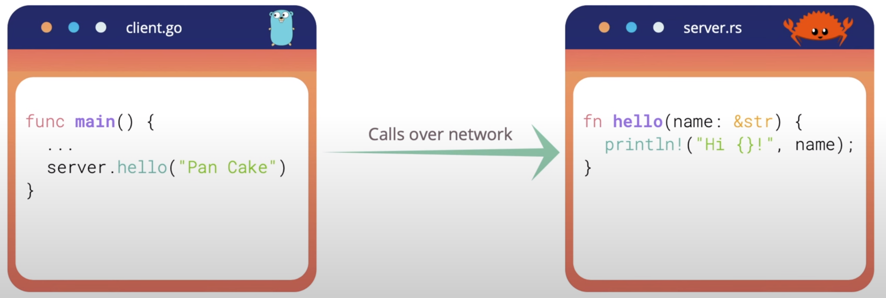

# What is gRPC and how it works
Welcome back! In the last lecture, we know that gRPC was invented to solve
the communication problem. So let's dive in to see how it works. What is gRPC?
It's a high-performance open-source feature-rich framework originally developed
by Google and now is a part of Cloud Native Computing Foundation (or CNCF) just
like Kubernetes or Prometheus. So what G in gRPC stands for? At first, I
thought it's Google. Yeah, you know why :) But in fact, it stands for different
things in each gRPC release such as good, green, glorious, and even gRPC itself
You can check out full list in this [link](https://github.com/grpc/grpc/blob/master/doc/g_stands_for.md).
OK, how about RPC? Well, RPC stands for Remote Procedure Calls.
## What is Remote Procedure Calls?
It's a protocol that allows a program to execute a procedure of another program
located in other computer. And what's awesome about it is that developers don't
have to explicitly coding the details of the network interaction. It's
automatically handled by the underlying framework. So in the client code, it
looks like we are just calling a function of the server code directly. And it
works even if the codes on client and server are written in different
programming languages. Like in this example, the client code is written in Go
and the server code is written in Rust.

**Picture 1** - Client in Go and Server in Rust
## How gRPC works?
Now let's see how can gRPC do that. Basically, the client has a stub that
provides the same method or function as the server. The stub is automatically
generated for you by gRPC. The stub will call gRPC framework under the hood to
exchange information with the server over the network.

**Picture 2** - How gRPC works (Image source: https://grpc.io/docs/guides/)

And voila! Magically, everything just works. Thanks to the stub, the client and 
server now only need to care about implementing their core services' logic.
We will see how the gRPC stubs are generated with help of protocol buffer in
the next lecture.