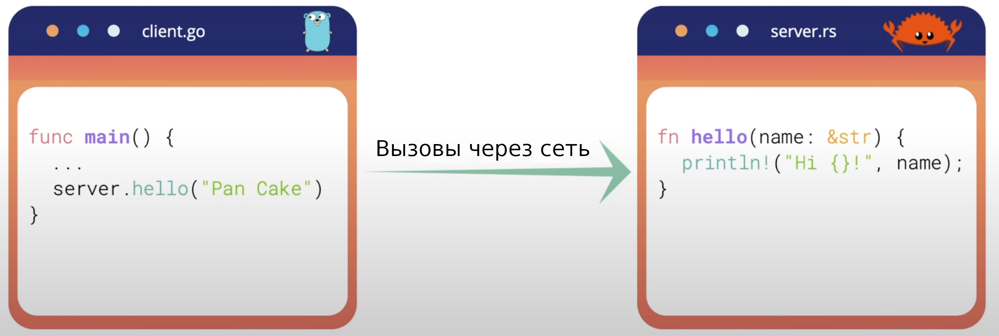

# Что такое gRPC и как он работает
Рад снова вас приветствовать! В предыдущей лекции мы узнали, что gRPC был 
создан для решения проблемы обмена информацией. Итак, давайте детальнее
рассмотрим принцип его работы. Что же такое gRPC? Это высокопроизводительный 
многофункциональный фреймворк с открытым исходным кодом, первоначально 
разработанный Google и теперь являющийся частью [Cloud Native Computing 
Foundation](https://en.wikipedia.org/wiki/Cloud_Native_Computing_Foundation) 
(или CNCF) как и Kubernetes или Prometheus. Итак, что же означает буква G в 
gRPC? Сначала я подумал, что Google. Вероятно, вы догадываетесь почему :) 
Но на самом деле она расшифровывается по-разному для каждой версии gRPC: good, 
green, glorious и даже gRPC. Вы можете просмотреть полный список по этой [ссылке](https://github.com/grpc/grpc/blob/master/doc/g_stands_for.md).
Хорошо, что же такое RPC? Итак, RPC означает удалённый вызов процедур (Remote
Procedure Calls).
## Что такое удалённый вызов процедур?
Это протокол, который позволяет программе выполнять функцию или процедуру 
программы в другом адресном пространстве, расположенной на другом компьютере. 
Преимущество при использовании данного метода заключается в том, что 
разработчики явно не занимаются программированием сетевого взаимодействия. Эту
роль берет на себя соответствующий фреймворк. Таким образом, в клиентском 
коде такой подход похож на непосредственный вызов функции, расположенной на 
сервере. Это работает даже если код на клиенте и сервере написан на разных 
языках программирования. Например в примере на рисунке, код клиента написан на 
Go, а код сервера — на Rust.

**Рисунок 1** - Клиент на Go и сервер на Rust
## Как работает gRPC?
Теперь давайте посмотрим как это реализуется в gRPC. В общих чертах для клиента 
создается заглушка, которая предоставляет тот же метод или функцию, что и 
сервер. Заглушка автоматически генерируется gRPC. Под капотом заглушка вызывает
gRPC фреймворк для обмена информацией с сервером по сети.

**Рисунок 2** - Как работает gRPC (Изображение взято с сайта: https://grpc.io/docs/guides/)

И вуаля! Волшебным образом всё работает. Благодаря заглушке, клиенту и серверу 
нужно только реализовать логику, связанную с их основными представляемыми 
услугами. На следующей лекции мы увидим как генерируются gRPC заглушки с 
помощью protocol buffer.