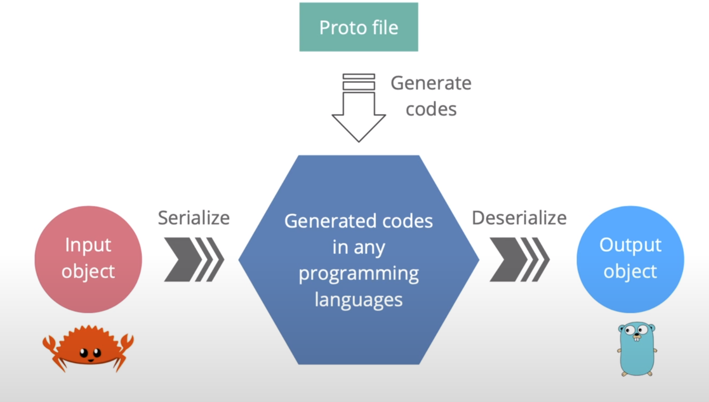
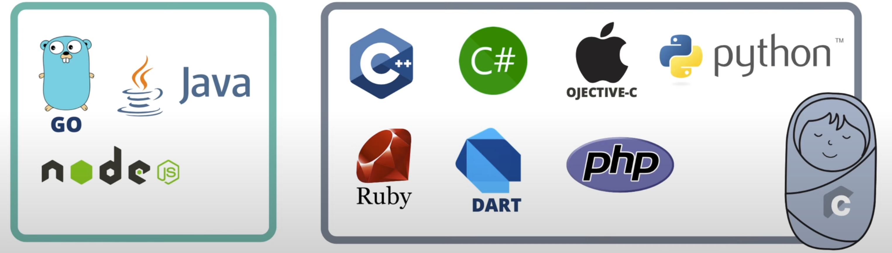

# gRPC code generation with Protocol Buffer
Code generation is one of the most important features of gRPC. In this lecture
we're gonna learn how it's done with protocol buffer.
## How stubs are generated?
In order to generate stubs for server and client, we first need to write the
API contract which includes a description of the services and their payload
messages in a protocol buffer file that looks something like [this](code/lecture3/welcome.proto).
In this [file](code/lecture3/welcome.proto), a `Hello` method is defined, which
takes a `HelloRequest` as input and returns a `HelloResponse`. The 
`HelloRequest` contains only a string `name` and the `HelloResponse` has a 
string `greet`. Very simple, right? We will learn much more detail about this 
later. In the hands-on with protocol buffer lecture from this proto file, the 
server and client stub codes are generated by the protocol buffer compiler 
(or protoc). Depending on the programming language, we will have to tell the 
compiler to use the correct gRPC plugins for it. The generated code for [Rust](code/lecture3/welcome.rs)
and [Go](code/lecture3/welcome.go) will look something like this.
## Why gRPC uses Protocol Buffer?
OK, so you may wonder why gRPC uses protocol buffer. Well there are many
reasons. First, it's super easy to read and understand. Second, it's language 
interoperable with automatic code generation for many languages. It represents
data in binary format which is smaller size, faster to transport and more
efficient to serialize than some text-based format like JSON or XML. It provides
a strong-type API contact between client and server, which is super safe to 
work with. And it has a great set of rules for API evolution to ensure backward
and forward compatibility. Sounds pretty amazing, right. But, is protocol buffer
required to work with gRPC? The answer is no. You can use Google flatbuffers or
Microsoft bond instead. But in my opinion, protocol buffer is already a great
choice.

**Picture 1** - gRPC code generation with Protocol Buffer
## What languages are supported by gRPC?
It supports a lot of programming languages with 10 officially supported where 
Go, Java and NodeJs are purely implemented and 7 others are wrappers of the 
gRPC-core C namely C++, C#, Objective-C, Python, Ruby, DART and PHP. Besides, 
there are many other unofficial libraries for other languages such as Swift,
Rust, Typescript, Haskell and so on.
Alright, now we know how gRPC generate codes for us. I hope you find it
interesting. In the next lecture, we will explore another secret weapon of gRPC
which is HTTP version 2. See you then!

**Picture 2** - Languages supported by gRPC