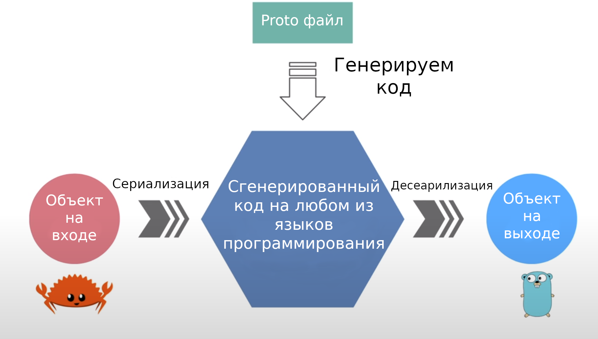

# Генерация gRPC кода с помощью Protocol Buffer
Генерация кода — одна из важнейших функций gRPC. На этой лекции мы узнаем как 
реализовать её с помощью protocol buffer.
## Каким образом генерируются заглушки?
Чтобы сгенерировать заглушки для сервера и клиента, нам нужно расписать API 
контракт, который включает описание сервисов и сообщений, связанных с ними, в 
файле protocol buffer, имеющий примерно следующий [вид](code/lecture3/welcome.proto).
В этом [файле](code/lecture3/welcome.proto), определен метод `Hello`, который 
принимает на вход `HelloRequest` и возвращает `HelloResponse`. `HelloRequest` 
содержит одно строковое поле `name`, а `HelloResponse` - строковое поле `greet`.
Очень просто, не так ли? Мы рассмотрим принципы описания сервисов и сообщений 
гораздо более подробно немного позднее. На лекции, посвященной практической 
работе с protocol buffer, из этого proto файла генерируются коды заглушек для 
сервера и клиента, с помощью компилятора protocol buffer (или protoc). В 
зависимости от используемого языка программирования, мы должны указать 
компилятору какие gRPC плагины следует применить. Сгенерированный код для [Rust](code/lecture3/welcome.rs)
и [Go](code/lecture3/welcome.go) будет выглядеть примерно следующим образом.
## Почему gRPC использует Protocol Buffer?
Возможно Вы спросите: почему gRPC использует protocol buffer. Существует 
несколько причин. Во-первых, его очень просто читать и воспринимать. Во-вторых,
этот язык совместим с разными языками программирования и позволяет 
автоматически генерировать код для них. Он представляет данные в двоичном 
формате, из-за чего они меньше по размеру, быстрее передаются по сети и 
эффективнее сериализуются, чем некоторые текстовые форматы, такие как JSON или
XML. Он создает строгий API контракт между клиентом и сервером безопасный для
работы. Кроме того, он содержит набор правил для эволюции API, гарантирующих 
прямую и обратную совместимость. Звучит потрясающе, не так ли? Но действительно
ли protocol buffer необходим для работы с gRPC? Ответ — нет. Вы можете 
использовать [Google flatbuffers](https://google.github.io/flatbuffers/) или 
[Microsoft bond](https://github.com/microsoft/bond) вместо него. Но на мой 
взгляд protocol buffer уже является отличным выбором.

**Рисунок 1** - Генерация gRPC кода с помощью Protocol Buffer
## Какие языки программирования поддерживает gRPC?
Он поддерживает множество языков программирования, из которых 10 официально
поддерживаются, где Go, Java и NodeJs реализованы напрямую, а 7 других являются
надстройками над gRPC ядром, написанном на C, а именно C++, C#, Objective-C,
Python, Ruby, DART и PHP. Кроме того, существует множество других неофициальных
библиотек для других языков, таких как Swift, Rust, Typescript, Haskell и так 
далее.
Отлично, теперь мы знаем как gRPC генерирует код за нас. Я надеюсь, что эта
информация была полезной. На следующий лекции мы изучим ещё одно секретное 
оружие gRPC, которым является HTTP версии 2. До новых встреч!

**Рисунок 2** - Языки, поддерживаемые gRPC