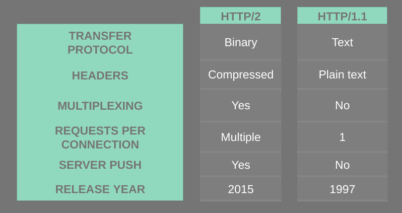

# Http/2 - The secret weapon of gRPC
Hello and welcome back to the gRPC course. In this lecture, we will learn about
HTTP/2 and what makes it great. OK, let's find out!
## What makes gRPC efficient?
gRPC uses HTTP/2 as its Transfer Protocol. So it inherits some great features 
that HTTP/2 offers such as binary framing which is high-performance and robust,
lighter to transport and safer to decode compared to other text-based protocol.
And because it's binary, it's a great combination with protocol buffer.
HTTP/2 also compresses the headers using HPACK which will reduce overhead cost 
and improve the performance. Multiplexing is possible in HTTP/2 which means the 
client and server can send multiple requests and responses in parallel over a
single TCP connection. This will help reduce the latency and improve the network
utilization. And finally, HTTP/2 allows server push where with one single 
request from client, the server can send back multiple responses. This is
extremely valuable to reduce the round-trip latency between client and server in
many cases when the server knows exactly what resources the client will need and
send them before they are even requested.

**Picture 1** - The gRPC Go stacks (Image source: https://grpc.io/blog/grpc-stacks/)

Now let's check out this [demo](http://http2.demo.io) to see how fast HTTP/2 is,
compared to HTTP/1.1. OK, basically in this demo we will try to load 200 small 
images from the server. I'm gonna refresh this. OK, so it takes 1.26 seconds 
for HTTP/1.1. Now, let's try HTTP/2. OK, it's only 0.62 seconds. As you can 
see, HTTP/2 loads almost twice as fast as HTTP/1.1.

## How HTTP/2 works under the hood
So, how HTTP/2 works under the hood? Its logical structure can be represented as
in this picture. There's a single TCP connection that carries multiple
bi-directional streams. Each stream has a unique identifier and carries multiple
bi-directional messages. Each message, can be request or response, is broken
down into multiple binary frames. A frame is the smallest unit that carries 
different types of data. For example: headers, settings, priority, data, and so
on. In fact, the streams do not actually flow separately. But their frames are
interleaved on the connection and will be reassembled when reaching the other 
side. Thanks to this binary framing layer, stream multiplexing is possible in 
HTTP/2.

**Picture 2** - Logical structure of stream, message and frame within a single
HTTP/2 connection

**Picture 3** - Frames are interleaved (Image source: 
https://developers.google.com/web/fundamentals/performance/http2)
## HTTP/2 vs HTTP/1.1
OK, so now you've understood how HTTP/2 works let's do a comparison with
HTTP/1.1 to see the differences between them. First, HTTP/2 is a binary 
protocol, while HTTP/1.1 is text. Headers are compressed in HTTP/2, while it's
plain text in HTTP/1.1. HTTP/2 allows multiplexing while HTTP/1.1 doesn't. We 
can send multiple request and responses in a single connection in HTTP/2 while 
in HTTP/1.1 we can send only 1 which means, we must create multiple separate
TCP connections to send multiple requests. Server push is possible with HTTP/2
but not in HTTP/1.1 and finally, HTTP/2 was released recently in 2015 while
HTTP/1.1 was released in 1997.

**Picture 4** - HTTP/2 vs HTTP/1.1

**Picture 5** - Multiple requests over HTTP/2 and HTTP/1.1 connections
(Image source: https://blog.cloudflare.com/http-2-for-web-developers/)

OK, so that wraps up our lecture about HTTP/2. In the next lecture we will learn
about different use cases of gRPC and compare it with REST. Thanks for reading
and see you soon!