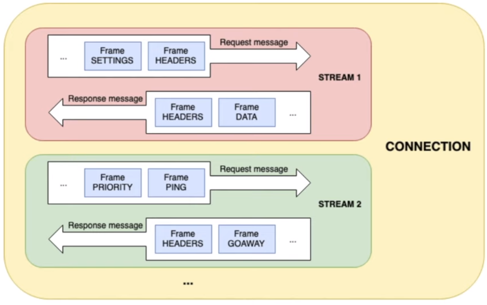
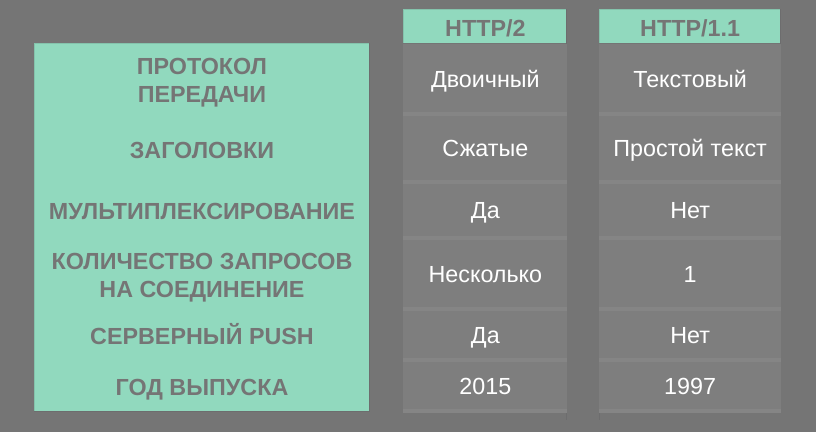
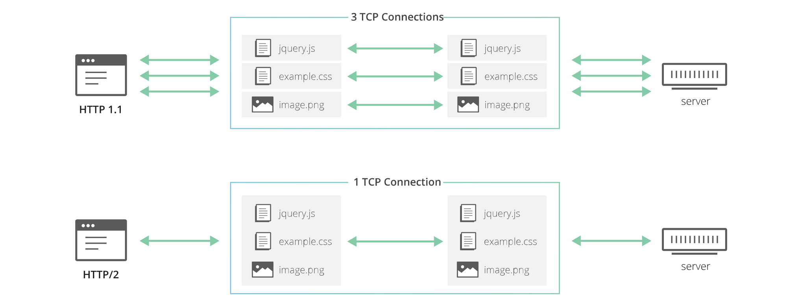

# Http/2 - секретное оружие gRPC
Здравствуйте, рад снова вас приветствовать на курсе по gRPC. На этой лекции мы 
рассмотрим протокол HTTP/2 и его преимущества. Что ж, давайте начнём!
## Благодаря чему gRPC так эффективен?
gRPC использует HTTP/2 в качестве протокола передачи данных (рисунок 1). 
Таким образом, он наследует некоторые замечательные функции, которые 
предоставляет HTTP/2, например, бинарное кадрирование. Оно намного 
высокопроизводительнее и надежнее, его проще передавать и безопаснее 
декодировать по сравнению с другими текстовыми протоколами. Поскольку кадр 
является двоичным, он эффективнее работает с буфером протокола.
HTTP/2 также сжимает заголовки с помощью HPACK, что снижает накладные расходы и
улучшает производительность. В HTTP/2 возможно мультиплексирование, что означает
клиент и сервер могут отправлять несколько запросов и ответов параллельно через
одно TCP-соединение. Это помогает уменьшить задержку и улучшить использование 
сети. И, наконец, HTTP/2 позволяет использовать push-технологий на серверной 
стороне, когда на один запрос от клиента сервер может посылать множество 
ответов. Это полезно для уменьшения задержки двустороннего обмена между 
клиентом и сервером во многих случаях, когда сервер точно знает какие ресурсы 
потребуются клиенту и отравляет их раньше, чем они будут запрошены.

**Рисунок 1** - Стеки gRPC Go (Изображение взято с сайта: https://grpc.io/blog/grpc-stacks/)

Теперь давайте откроем этот [демо-сайт](http://http2.demo.io), чтобы увидеть,
насколько быстрее работает HTTP/2 по сравнению с HTTP/1.1. Этот демо-сайт 
пытается загрузить 200 маленьких изображений с сервера. Если нажать на кнопку 
`Refresh`, то загрузки через протокол HTTP/1.1 занимает 1,26 секунды. Теперь 
давайте попробуем использовать HTTP/2. Загрузка заняла всего 0.62 секунды. Как
видите, загрузка с помощью HTTP/2 происходит почти в два раза быстрее, чем 
через HTTP/1.1.

## Принцип работы HTTP/2
Итак, как же HTTP/2 работает под капотом? Его логическую структуру можно 
представить в виде, показанном на рисунке 2. Существует одно TCP-соединение, 
внутри которого содержится несколько двунаправленных потоков. Каждый поток 
имеет уникальный идентификатор и состоит из нескольких двунаправленных 
сообщений. Каждое сообщение, которое может быть запросом или ответом, 
разбивается на несколько двоичных кадров. Кадр — это наименьшая единица, 
содержащая различные типы данных. Например, заголовки, настройки, приоритет, 
данные и т. д. На самом деле потоки не передаются по отдельности. Их кадры 
чередуются (рисунок 3) внутри соединения и будут восстановлены, когда достигнут
получателя. Благодаря этому слою бинарного кадрирования возможно 
мультиплексирование потоков в HTTP/2.

**Рисунок 2** - Логическая структура потока, сообщения и кадра в одном
HTTP/2 соединении

**Рисунок 3** - Чередование кадров (Изображение взято с сайта: 
https://developers.google.com/web/fundamentals/performance/http2)
## Сравнение HTTP/2 и HTTP/1.1
Хорошо, теперь, когда вы понимаете как работает HTTP/2, давайте сравним его с 
HTTP/1.1, чтобы увидеть различия между ними (рисунок 4). Во-первых, HTTP/2 - 
это бинарный протокол, тогда как HTTP/1.1 - текстовый. Заголовки сжимаются в 
HTTP/2, а в HTTP/1.1 они являются обычным текстом. HTTP/2 реализовано 
мультиплексирование, в HTTP/1.1 его нет. Мы можем посылать несколько запросов 
и ответов в одном соединении в HTTP/2, тогда как в HTTP/1.1 мы можем послать 
только один, то есть мы должны создать несколько отдельных TCP-соединений для 
отправки нескольких запросов (рисунок 5). Push-технологии на серверной стороне 
можно использовать в HTTP/2, но не в HTTP/1.1. Наконец, HTTP/2 был выпущен 
относительно недавно в 2015 году, тогда как год выпуска HTTP/1.1 - 1997.

**Рисунок 4** - Сравнение HTTP/2 и HTTP/1.1

**Рисунок 5** - Множественные запросы через соединения HTTP/2 и HTTP/1.1
(Изображение взято с сайта: https://blog.cloudflare.com/http-2-for-web-developers/)

На этом мы завершим нашу лекцию, посвященную HTTP/2. На следующей лекции мы 
изучим различные варианты использования gRPC и сравним его с REST. Спасибо за 
уделенное время и до скорой встречи!