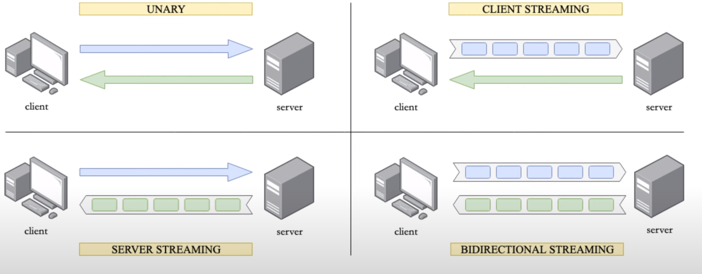
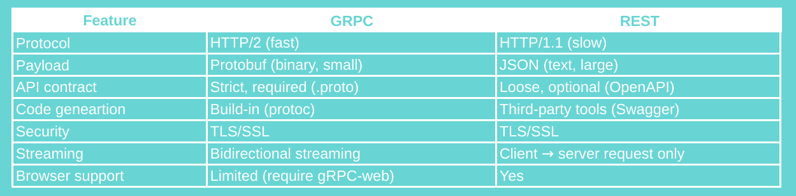

# Is gRPC better than REST? Where to use it?
Hello and welcome back! In this lecture, we will discover some use cases of gRPC
and how does it compare to REST. There are 4 types of gRPC. The simplest one is
unary, where the client sends 1 single request message and server replies with 
1 single response. This looks somewhat similar to the normal HTTP API. Then we
have client streaming. In this scenario, the client will send a stream of 
multiple messages and it expects the server to send back only 1 single response.
Similarly, we have server streaming, where the client sends only 1 request 
message and the server replies with a stream of multiple messages. Finally,
the bi-directional or bidi streaming. This one is the most complex because the 
client and the server will keep sending and receiving multiple messages in
parallel and with arbitrary order. It's very flexible and no blocking which 
means, no sides need to wait for the response before sending the next message.

**Picture 1** - 4 types of gRPC
OK, so that's a very high-level overview of the 4 different ways of 
communication in gRPC. We will come back to this later on the hands-on lecture
where we implement each and every one of them to get much deeper understanding.
## gRPC vs REST
Now, let's do a quick comparison of gRPC and REST to see their differences.
First gRPC uses HTTP/2 which is, as you know, much faster than HTTP/1.1 used in
REST. Second, gRPC uses protocol buffer to serialise payload data which is
binary and smaller while REST uses JSON, which is text and larger. The API
contract in gRPC is strict and required to be clearly defined in a proto file
while in REST, it's often loose and optional. We can define it via OpenAPI if
we want, but it's not mandatory. Code generation is build-in in gRPC with the 
help of the protocol buffer compiler while in REST we must use third-party
tools like OpenAPI and Swagger. Both gRPC and REST communications are secured
with SSL. Streaming is bi-directional in gRPC while only 1-way request from 
client to server in REST. So gRPC is better than REST for most of the things 
that we have mentioned so far. However, there's 1 thing that REST is still
better. That is browser support. While REST is fully supported by all browsers
the support for gRPC is limited and it requires gRPC-web with a proxy layer to
convert between HTTP/1 and HTTP/2.

**Picture 2** - gRPC vs REST
## Where to use gRPC?
So, gRPC has a lot of strengths, but it also has its own weaknesses. So where 
and when should we use gRPC in order to take full advantage of it? As you might
have guessed, micro-services is where gRPC really shines since it enables low 
latency and high throughput communication as well as strong API contract. gRPC 
is also suitable for polyglot environments because it provides code generations
out-of-the-box for many programming languages. Point-to-point real-time 
communication is also a good place for gRPC since it has excellent support for
bidirectional streaming. Finally, gRPC is a great choice for 
network-constrained environments, such as mobile apps because of it lightweight
message format.
Alright, so now you've finished all the theory lectures of the gRPC course.
Congratulations! I hope you enjoy it and I will see you in the hands-on
lectures.