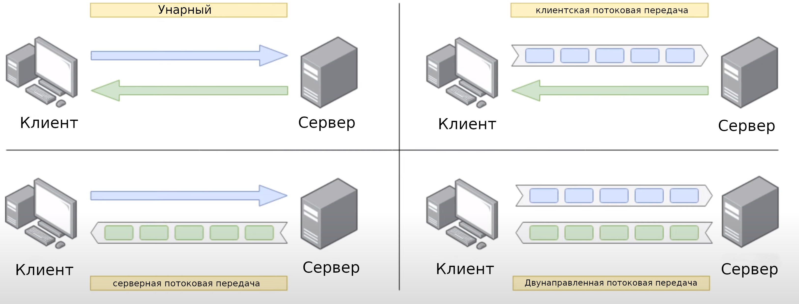
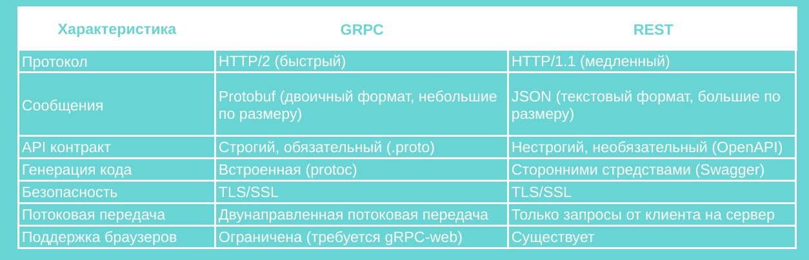

# Что лучше gRPC или REST? Где следует использовать gRPC?
Здравствуйте, рад снова вас приветствовать! На этой лекции мы познакомимся с 
некоторыми вариантами использования gRPC и сравним его с REST. Существует 4 
типа gRPC (рисунок 1). Простейший — унарный, когда клиент посылает одно 
сообщение-запрос, а сервер возвращает на него единственный ответ. Это 
напоминает обычную работу HTTP API. Следующий тип — клиентская потоковая 
передача. В этом случае клиент посылает поток из нескольких сообщений и 
ожидает, что сервер отправит только один ответ. Подобным образом работает 
серверная потоковая передача, когда клиент посылает только одно 
сообщение-запрос, а сервер возвращает поток из нескольких сообщений. И, 
наконец, двухсторонняя или двунаправленная потоковая передача. Это самый 
сложный случай, поскольку клиент и сервер посылают и получают множество 
сообщений параллельно в произвольном порядке. Этот тип gRPC является 
универсальным и не блокирующим. Это означает, что сторонам не нужно ждать 
ответа перед отправкой следующего сообщения.

**Рисунок 1** - 4 типа gRPC

На этом завершим общий, краткий обзор 4 различных способов взаимодействия в
gRPC. Мы рассмотрим их подробнее позже, на практической лекции, где реализуем
каждый из них для более глубокого понимания.
## Сравнение gRPC и REST
Теперь давайте сравним gRPC и REST (HTTP JSON API), чтобы увидеть, чем они 
отличаются (рисунок 2). Во-первых, gRPC использует HTTP/2, который как вы уже 
знаете, намного быстрее HTTP/1.1, применяемый в REST. Во-вторых, gRPC 
использует protocol buffer для сериализации данных (данные хранятся в двоичном 
виде и меньше по размеру), тогда как REST использует JSON (данные хранятся в 
текстовом виде и больше по размеру). API контракт в gRPC строгий и должен быть 
четко определен в proto файле, тогда как в REST он часто является нестрогим и 
необязательным. Мы можем определить его через OpenAPI, если захотим, но это не
обязательно. Генерация кода встроена в gRPC, благодаря компилятору protocol 
buffer, тогда как в REST мы должны использовать сторонние средства, такие как
OpenAPI и Swagger. И gRPC, и REST для защиты информации при передаче сообщений
используют SSL. В gRPC возможна двунаправленная потоковая передача, а в REST 
реализуется только односторонний запрос от клиента на сервер. Таким образом,
gRPC лучше, чем REST, по всем параметрам, упомянутым выше. Однако, существует 
единственная характеристика, где REST всё ещё лучше — это поддержка браузеров.
REST полностью поддерживается всеми браузерами, тогда как поддержка gRPC 
ограничена и для неё требуется gRPC-web с прокси-слоем для преобразования между
HTTP/1 и HTTP/2.

**Рисунок 2** - Сравнение gRPC и REST
## Где следует использовать gRPC?
Итак, у gRPC много сильных сторон, но есть и свои недостатки. Так где
и когда мы должны применять gRPC, чтобы полностью использовать его 
преимущества? Как вы могли догадаться, микросервисы — это та область, где gRPC
показывает себя действительно хорошо, благодаря низкой задержке и высокой 
пропускной способности, а также строгому API контракту. gRPC также 
используется, когда части системы написаны на разных языках программирования, 
поскольку позволяет генерировать готовый код для многих языков. gRPC хорош при
обмене сообщениями в реальном времени в соединениях типа "точка-точка", 
поскольку превосходно реализует двунаправленную потоковую передачу. Наконец, 
gRPC отличный выбор для сетей с ограниченными возможностями (с низкой 
скоростью передачи и пропускной способностью), например, для мобильных 
приложений, из-за упрощенного по сравнению с REST формата сообщения.

Итак, мы закончили все теоретические лекции по gRPC курсу. Поздравляю! Надеюсь
вам они понравились. Буду рад видеть вас на практических лекциях.