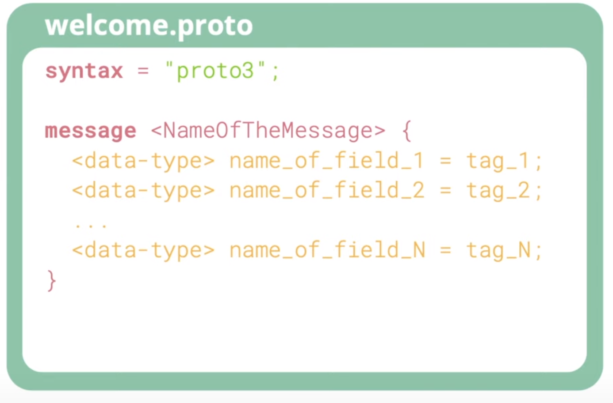

# Пишем простое protobuf сообщение и генерируем Go код
Всем привет, давайте начнем практический раздел gRPC курса. Цель всего раздела
заключается в том, чтобы создать веб-сервис для ноутбуков, который позволит 
нам задавать конфигурации ноутбуков и искать их. На этой лекции мы узнаем, 
как написать очень простое protocol buffer сообщение, используя некоторые 
базовые типы, и как написать комментарии к ним. Мы также научимся устанавливать
плагины для Visual Studio Code, чтобы работать с protobuf. Наконец мы установим
protocol buffer компилятор и напишем make-файл, который будет запускать 
генерацию кода для Go. Но прежде чем начать, убедитесь, что у вас уже 
установлены Go и Visual Studio Code, и они корректно работают на вашем 
компьютере. Если нет, вы можете посмотреть это [обучающее видео](https://youtu.be/jRLV-1GVET4)
о том как установить Go и настроить Visual Studio Code. Видео представляет 
собой пошаговое руководство по установке Go, добавления папки `bin` в ваш PATH,
установке Visual Studio Code, настройки его темы и расширений Go для работы с 
ним. Как только закончите настройку, можете продолжить читать эту лекцию с 
этого места.

## Устанавливаем VSCode плагины
Итак, начнём с создания нового проекта. Сначала я создам простую [программу, 
выводящую "Hello world"](code/lecture6/main.go) на Go и запущу её, чтобы 
убедиться, что Go работает правильно. Затем я создам новую папку с именем 
`proto` и добавлю в неё файл `processor_message.proto`. После этого VSCode 
хотим ли мы установить расширения для proto файла или нет. Да, мы хотим. 
Нажмите на кнопку Search marketplace внизу экрана. В верхней части списка будут
два расширения, которые нам следует установить `clang-format` и 
`VSCode-proto3`.

## Создаём protobuf сообщение
Теперь вернемся к нашему proto файлу. Этот файл будет содержать определение 
сообщения для ЦПУ ноутбука. В начале файла пропишем `syntax="proto3"`. На 
момент написания этой лекции, существовало две версии protocol buffer в 
официальной документации Google: `proto2` и `proto3`. Чтобы было проще 
реализовать код, мы будем использовать только `proto3` (более новую версию) в 
этом курсе. Теперь давайте посмотрим как определить сообщение. Синтаксис 
довольно прост. Достаточно использовать ключевое слово `message`, за которым 
следует название сообщения `<NameOfTheMessage>`. Затем внутри блока сообщения, 
мы определяем все его поля, как показано на рисунке 1.



**Рисунок 1** - Пример proto файла.

Название сообщения должно быть начинаться с большой буквы, а имя поля - с 
маленькой, используя snake case стиль. Существует множество встроенных 
скалярных типов данных, которые мы можем использовать. Например, `string`, 
`bool`, `byte`, `float` или `double` и множество целочисленных типов. Мы также
можем использовать наши собственных, пользовательские типы данных, такие как
перечисления (`enums`) или другие сообщения.

Каждому полю сообщения должен быть присвоен уникальный тег, причём тег важнее 
названия поля, поскольку protobuf будет использовать его для сериализации 
сообщения. Тег — это просто произвольное целое число с наименьшим значением 
равным 1, наибольшим значением — 536 870 911, за исключением чисел от 19000 
до 19999, поскольку они зарезервированы для внутренней реализации protocol 
buffer.

Обратите внимание, что закодировать теги от 1 до 15 можно с помощью одного 
байта (тег и тип данных поля), тогда как для кодировки тегов от 16 до 2047 
нужно два байта. Из-за этого для часто встречающихся полей лучше использовать 
теги от 1 до 15. Помните, что теги необязательно должны быть упорядочены или 
идти последовательно, но они должны быть уникальны для полей с одинаковым 
уровнем внутри сообщения.

## Задаём CPU сообщение
Итак, давайте вернемся к нашему proto файлу и определим сообщение для ЦПУ. ЦПУ
будет содержать фирму производителя с типом `string`, например, "Intel" и 
название, также с типом `string`, например, "Core i7-9850". Мы можем написать 
комментарий к каждому полю как в Go (//) или как в Java (/* ... */). Их 
очень просто создавать, поэтому я не хочу тратить время на написание 
комментариев в этом курсе. Но имейте в виду, что вы всегда должны писать 
подробные комментарии, когда работаете над реальным проектом. Они помогут 
вашим нынешним и будущим коллегам. Кроме того, мы хотим знать сколько ядер или
потоков у ЦПУ. Их число не может быть отрицательным, поэтому мы будем 
использовать для него тип `unsigned int 32`. Ещё у него есть минимальная и 
максимальная частота, например, 2,4 ГГц или какое-то близкое к этому значение.
Таким образом, в качестве типа данных безопасно будет использовать `float` или
`double`. Также вам нужно будет добавить параметр `go_package` в `.proto` 
файлы, чтобы указать название пакета, в котором будет находиться 
сгенерированный код. Добавьте строку `option go_package = ".;pb";` в начале 
proto файла.

```protobuf
syntax = "proto3";

option go_package = ".;pb";

message CPU {
  // Фирма производитель ЦПУ
  string brand = 1;
  /*
   * Название ЦПУ
   */
  string name = 2;
  uint32 number_cores = 3;
  uint32 number_threads = 4;
  double min_ghz = 5;
  double max_ghz = 6;
}
```

## Генерируем Go код
Отлично, мы создали наше первое protobuf сообщение. Каким образом сгенерировать
Go из него? Во-первых, нам нужно установить компилятор protocol buffer (или
`protoc`). В macOS это легко сделать с помощью Homebrew. Если у вас не 
установлен Homebrew, откройте браузер, найдите с помощью поисковика как его 
установить, затем скопируйте команду установки с сайта и запустите её в 
терминале. Установка для OC Linux описана [здесь](https://grpc.io/docs/protoc-installation/).
После установки Homebrew, выполните следующую команду:

```shell
brew install protobuf
```

Вот и всё! Мы можем проверить, что установка успешно завершилась, запустив 
команду `protoc`. Затем перейдите на сайт `grpc.io`, скопируйте и выполните 
две команды для установки двух Go библиотек. Во-первых, библиотеки 
`golang gRPC`

```shell
go get -u google.golang.org/grpc
```

и, во-вторых, библиотеку `protoc-gen-go`

```shell
go get -u github.com/golang/protobuf/protoc-gen-go
```

Теперь, когда у нас всё готово для генерации кода на Go, я создам новую папку
с названием `pb` для хранения сгенерированного кода. Затем выполните эту 
команду:

```shell
protoc --proto_path=proto --go_out=pb proto/*.proto
```

Наш proto файл находится внутри папки `proto`, поэтому мы должны указать
`protoc` искать его в этой папке. С помощью параметра `go_out` мы сообщаем
`protoc`, что нужно использовать gRPC плагины для генерации Go кода и 
сохранить полученный результат в папку `pb`, которую мы создали ранее. Теперь,
если мы откроем эту папку в Visual Studio Code, то увидим новый файл
`processor_message.pb.go`. Внутри него находится структура CPU и все поля с 
правильными типами данных, которые мы определили в нашем protocol buffer 
файле. Также она содержит несколько специальных полей, используемых внутри 
gRPC для сериализации сообщения, но они нас не интересуют. Ниже, под 
структурой, также сгенерированы некоторые полезные геттеры. Замечательно! 

## Создаем Makefile
Тем не менее, команда, которую мы использовали для генерации кода, довольно 
большая. Её неудобно вводить, если мы изменим что-то в proto файле и захотим 
повторно сгенерировать код. Давайте создадим make-файл с короткой и простой 
командой, позволяющей это сделать. Добавьте в него цель `gen` и затем 
вставьте команду для генерации кода под ней, а также добавьте цель `clean` для
удаления всех сгенерированных файлов. Мы также можем определить цель для 
запуска `main.go`.

```makefile
gen:
	protoc --proto_path=proto --go_out=pb proto/*.proto
clean:
	rm pb/*.go
run:
	go run main.go
```

Отлично, теперь попробуем выполнить их в терминале:

```shell
make clean
```

После этой команды сгенерированный файл будет удален,

```shell
make gen
```

а эта команда заново сгенерирует его в папке `pb`.

Наконец,

```shell
make run
```

напечает `Hello world`. Ух, эта была длинная лекция. Благодарю за потраченное 
время! Нам ещё предстоит многое изучить, поэтому надеюсь что вы продолжите 
читать эти лекции. А пока желаю вам получать удовольствие от написания 
программ.