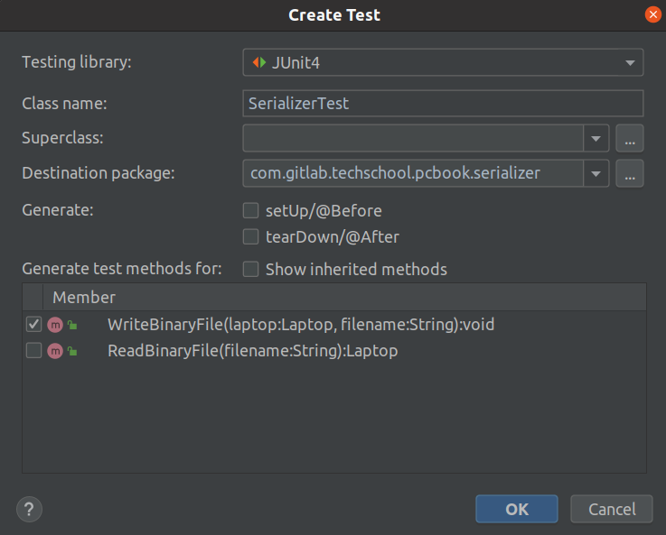
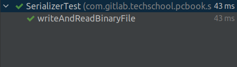

# Сериализация protobuf сообщения - Java
Всем привет, рад снова видеть вас на второй половине 9-й лекции gRPC курса. На
предыдущей лекции мы узнали как сериализовать protobuf сообщение в Go. Теперь
сделаем это на Java.

## Создаём protobuf сообщения, используя генератор случайных чисел
Откройте `Gradle` проект, который мы настроили на предыдущей лекции. Я создам
новый пакет `com.gitlab.techschool.pcbook.sample` в папке `src/main/java` и 
добавлю класс `Generator` в него. Логика работы будет очень похожа на ту, что 
мы реализовали в Go.

### Генерируем клавиатуру со случайными параметрами
Сначала зададим функцию `NewKeyboard`. Создать protobuf сообщение в Java очень 
просто, поскольку `protoc` сгенерировал за нас несколько методов-строителей и
методов-сеттеров. Здесь мы просто вызываем по цепочке `Keyboard.newBuilder()` 
и `setLayout()`, передавая `randomKeyboardLayout()` в качестве параметра.   

```java
Keyboard.newBuilder().
    .setLayout(randomKeyboardLayout())
```

В Intellij IDEA, мы можем использовать сочетание клавиш `Option + Enter` 
(на macOS) или `Alt + Enter` (на Windows и Linux), чтобы открыть автодополнение 
кода. Установите курсор на названии `randomKeyboardLayout()` и откройте 
автодополнение кода. Выберите "Create a new method" и метод 
`randomKeyboardLayout()` будет создан автоматически. Аналогично мы можем по 
цепочке вызвать метод `setBacklit()`. Теперь нам нужно использовать объект 
`Random` для генерации случайных значений, поэтому я добавлю в класс приватное 
свойство `rand`.

```java
private Random rand;
```

и инициализую его внутри конструктора класса `Generator`.

```java
public Generator() {
    rand = new Random();
}
```

Если мы зажмём Command (в macOS) или Ctrl (в Windows или Linux) и нажмём на
`new Random()`, то перейдём к его реализации. Там видно, что случайный 
генератор уже использует начальное значение, зависящее от времени. Таким 
образом, нам не нужно настраивать его вручную, как мы это делали в Go. Теперь
мы можем использовать метод `rand.nextBoolean()`, чтобы задать значение для 
поля подсветки следующим образом:

```java
.setBacklit(rand.nextBoolean())
```

И, наконец, мы вызываем метод `build()` для создания объекта-клавиатуры.

```java
public Keyboard NewKeyboard() {
    return Keyboard.newBuilder().
                .setLayout(randomKeyboardLayout())
                .setBacklit(rand.nextBoolean())
                .build();
}
```

Реализация метода `randomKeyboardLayout()` довольно проста. С помощью 
`rand.NextInt()` (в Go использовалась функция rand.Intn()) мы возвращаем 
QWERTY, QWERTZ или AZERTY в зависимости от того чему равно случайное значение.

```java
private Keyboard.Layout randomKeyboardLayout() {
    switch (rand.nextInt(3)) {
        case 1:
            return Keyboard.Layout.QWERTY;
        case 2:
            return Keyboard.Layout.QWERTZ;
        default:
            return Keyboard.Layout.AZERTY;
    }
}
```

### Генерируем ЦПУ со случайными параметрами
Затем создадим метод `NewCPU()`. Нам понадобится случайным образом выбранная 
фирма-производитель ЦПУ, значение которой может быть равно "Intel" или "AMD".

```java
public CPU NewCPU() {
    String brand = randomCPUBrand();
}

private String randomCPUBrand() {
    return randomStringFromSet("Intel", "AMD");
}
```

Давайте реализуем метод `randomStringFromSet`, возвращающий случайную строку
из множества. Идея такая же. Мы используем `rand.NextInt`, чтобы получить 
случайный индекс и вернуть строку, расположенную по этому индексу.

```java
private String randomStringFromSet(String ...a) {
    int n = a.length;
    if (n == 0) {
        return "";
    }
    return a[rand.nextInt(n)];
}
```

Название ЦПУ будет генерироваться случайным образом с учётом 
фирмы-производителя. Поскольку существует всего две фирмы-производителя, здесь 
я воспользуюсь оператором `if`.

```java
public CPU NewCPU() {
    // ...
    String name = randomCPUName(brand);
}

private String randomCPUName(String brand) {
    if (brand == "Intel") {
        return randomStringFromSet(
                "Xeon E-2286M",
                "Core i9-9980HK",
                "Core i7-9750H",
                "Core i5-9400F",
                "Core i3-1005G1"
        );
    }
    return randomStringFromSet(
            "Ryzen 7 PRO 2700U",
            "Ryzen 5 PRO 3500U",
            "Ryzen 3 PRO 3200GE"
    );
}
```

Количество ядер можно легко сгенерировать с помощью функции `randomInt`. Она
возвращает случайное целое число в диапазоне от `min` до `max`. Здесь 
используется формула аналогичная той, что мы применяли в Go. Такую же аналогию
можно провести для количества потоков. Мы используем `randomInt`, чтобы 
сгенерировать число в промежутке между количеством ядер до 12.

```java
public CPU NewCPU() {
    /// ...

    int numberCores = randomInt(2, 8);
    int numberThreads = randomInt(numberCores, 12);
}
private int randomInt(int min, int max) {
    return min + rand.nextInt(max - min + 1);
}
```

Те же рассуждения касаются частот, за исключением того, что мы должны 
определить метод для генерации случайного числа с плавающей запятой двойной
точности между `min` and `max`. Отличием от `randomInt` заключается в том, что
метод `nextDouble` возвращает число от 0 и 1.

```java
public CPU NewCPU() {
    // ...
    
    double minGhz = randomDouble(2.0, 3.5);
    double maxGhz = randomDouble(minGhz, 5.0);
}
private double randomDouble(double min, double max) {
    return min + rand.nextDouble() * (max - min);
}
```

Теперь всё что нам нужно сделать — это вызвать новый построитель, использовать
методы-сеттеры для присваивания значений всем полям, затем создать объект и
вернуть его.

```java
public CPU NewCPU() {
    // ...

    return CPU.newBuilder()
        .setBrand(brand)
        .setName(name)
        .setNumberCores(numberCores)
        .setNumberThreads(numberThreads)
        .setMinGhz(minGhz)
        .setMaxGhz(maxGhz)
        .build();
}
```

### Генерируем GPU со случайными параметрами
Итак, с ЦПУ закончили, теперь займемся GPU. Мы напишем метод, возвращающий GPU 
со случайной фирмой-производителем, которой может быть NVIDIA 
или AMD. Затем мы сгенерируем случайное название GPU на основе данных о 
фирме-производителе. Опять же, я буду использовать оператор `if` и заранее 
определенный список значений.

```java
public GPU NewGPU() {
    String brand = randomGPUBrand();
    String name = randomGPUName(brand);
}

private String randomGPUBrand() {
    return randomStringFromSet("NVIDIA", "AMD");
}

private String randomGPUName(String brand) {
    if (brand == "NVIDIA") {
        return randomStringFromSet(
                "RTX 2060",
                "RTX 2070",
                "GTX 1660-Ti",
                "GTX 1070"
        );
    }

    return randomStringFromSet(
            "RX 590",
            "RX 580",
            "RX 5700-XT",
            "RX Vega-56"
    );
}
```

`min` и `max` частоты генерируются, используя метод `randomDouble`, который мы
определили ранее. GPU очень похож на ЦПУ, единственное отличие заключается в 
том, что нам нужно создать объект для памяти. Допустим мы хотим чтобы её объём
менялся в диапазоне от 2 до 6 гигабайт. Перечисление для единиц измерения 
памяти было сгенерировано за нас, поэтому воспользуемся им.

```java
public GPU NewGPU() {
    // ...

    double minGhz = randomDouble(1.0, 1.5);
    double maxGhz = randomDouble(minGhz, 2.0);

    Memory memory = Memory.newBuilder()
            .setValue(randomInt(2, 6))
            .setUnit(Memory.Unit.GIGABYTE)
            .build();
}
```

Затем мы можем создать GPU и присвоить значения его полям. Для этого удобно 
использовать методы-сеттеры, которые `protoc` сгенерировал за нас.

```java
public GPU NewGPU() {
    // ...
    
    return GPU.newBuilder()
            .setBrand(brand)
            .setName(name)
            .setMinGhz(minGhz)
            .setMaxGhz(maxGhz)
            .setMemory(memory)
            .build();
}
```

### Генерируем ОЗУ со случайными параметрами
После того как мы создали GPU, следующей на очереди будет ОЗУ. Она практически
не отличается от памяти GPU. Мы вызываем построитель, задаём объём памяти от
4 до 64 гигабайт, затем создаём объект и возвращаем его.

```java
public Memory NewRAM() {
    return Memory.newBuilder()
            .setValue(randomInt(4, 64))
            .setUnit(Memory.Unit.GIGABYTE)
            .build();
}
```

### Генерируем накопитель со случайными параметрами
Теперь займёмся накопителями. Мы напишем два отдельных метода для создания SSD
и HDD. Для SSD объём будет меняться в диапазоне от 128 до 1024 гигабайт, а 
значение для драйвера будет равно SSD. Присвойте значения всем полям и 
создайте объект.

```java
public Storage NewSSD() {
    Memory memory = Memory.newBuilder()
            .setValue(randomInt(128, 1024))
            .setUnit(Memory.Unit.GIGABYTE)
            .build();
    
    return Storage.newBuilder()
            .setDriver(Storage.Driver.SSD)
            .setMemory(memory)
            .build();
}
```

Я скопирую этот метод и изменю значения на HDD где необходимо. В этот раз объём
будет меняться от 1 до 6 терабайт и значение для драйвера должно быть равно
HDD.

```java
public Storage NewHDD() {
    Memory memory = Memory.newBuilder()
            .setValue(randomInt(1, 6))
            .setUnit(Memory.Unit.TERABYTE)
            .build();

    return Storage.newBuilder()
            .setDriver(Storage.Driver.HDD)
            .setMemory(memory)
            .build();
}
```

### Генерируем экран со случайными параметрами
Сгенерировать экран также совсем не сложно. Мы зададим высоту как случайное 
целое число в диапазоне от 1080 до 4320 и вычислим ширину по высоте, используя 
соотношение сторон 16 на 9. Далее мы создадим новый объект "Разрешение экрана"
со случайно сгенерированными значениями высоты и широты. Затем мы зададим 
значения для оставшихся поля экрана. Размер экрана будет меняться от 13 до 17
дюймов. Мы напишем для этого метод `randomFloat`, аналогичный ранее написанному
методу `randomDouble`. Теперь займемся типом матрицы экрана. Давайте напишем 
для него отдельный метод, возвращающий случайное значение. В нашем приложении
существует только два типа матриц: `IPS` или `OLED`. Последнему полю — 
мультитач — присвоим случайное логическое значение.

```java
public Screen NewScreen() {
    int height = randomInt(1080, 4320);
    int width = height * 16 / 9;

    Screen.Resolution resolution = Screen.Resolution.newBuilder()
            .setHeight(height)
            .setWidth(width)
            .build();

    return Screen.newBuilder()
            .setSizeInch(randomFloat(13, 17))
            .setResolution(resolution)
            .setPanel(randomScreenPanel())
            .setMultitouch(rand.nextBoolean())
            .build();
}

private Screen.Panel randomScreenPanel() {
    if (rand.nextBoolean()) {
        return Screen.Panel.IPS;
    }
    return Screen.Panel.OLED;
}

private float randomFloat(float min, float max) {
    return min + rand.nextFloat() * (max-min);
}
```

### Генерируем ноутбук со случайными параметрами
Наконец, мы можем сгенерировать ноутбук со случайными параметрами. В качестве 
фирмы-производителя ноутбука будем использовать одно из трех значений: "Apple",
"Dell" или "Lenovo", от которого будет зависеть случайное значение для названия
ноутбука. Здесь мы воспользуемся оператором `switch-case`, чтобы задать 
правильное название ноутбука в зависимости от фирмы-производителя. Затем 
определим вес в килограммах, цену в USD и год выпуска. Теперь просто вызовите 
по цепочке `Laptop.newBuilder()` и методы-сеттеры для каждого компонента 
ноутбука. Обратите внимание, что для GPU и накопителей мы используем метод 
`Add`, а не `Set`, поскольку они являются полями типа `repeated`, т. е. 
содержат список объектов, а не один объект. Не составляет труда присвоить 
значения оставшимся полям. Задать значение для поля `updateAt` немного сложнее,
чем в Go, так как не существует метода для получения текущей временной метки в
виде объекта `protobuf.Timestamp`. Давайте реализуем этот метод сами и назовём
его `timestampNow()`. Воспользуемся методом `Instant.now()` пакета `java.time`,
чтобы получить текущую временную метку. Затем создадим из неё объект 
`Timestamp`. Метод `NewLaptop` завершен и готов к использованию.

```java
public Laptop NewLaptop() {
    String brand = randomLaptopBrand();
    String name = randomLaptopName(brand);

    double weightKg = randomDouble(1.0, 3.0);
    double priceUsd = randomDouble(1500, 3500);

    int releaseYear = randomInt(2015, 2019);

    return Laptop.newBuilder()
            .setBrand(brand)
            .setName(name)
            .setCpu(NewCPU())
            .setRam(NewRAM())
            .addGpus(NewGPU())
            .addStorages(NewSSD())
            .addStorages(NewHDD())
            .setScreen(NewScreen())
            .setKeyboard(NewKeyboard())
            .setWeightKg(weightKg)
            .setPriceUsd(priceUsd)
            .setReleaseYear(releaseYear)
            .setUpdatedAt(timestampNow())
            .build();
}

private Timestamp timestampNow() {
    Instant now = Instant.now();
    return Timestamp.newBuilder()
        .setSeconds(now.getEpochSecond())
        .setNanos(now.getNano())
        .build();
}

private String randomLaptopName(String brand) {
    switch (brand) {
        case "Apple":
            return randomStringFromSet("Macbook Air", "MacbookPro");
        case "Dell":
            return randomStringFromSet("Latitude", "Vostro", "XPS", "Alienware");
        default:
            return randomStringFromSet("ThinkPad X1", "Thinkpad P1", "Thinkpad P53");
    }
}

private String randomLaptopBrand() {
    return randomStringFromSet("Apple", "Dell", "Lenovo");
}
```

Давайте наберём `psvm`, чтобы создать `main` метод, и протестируем работу 
метода `NewLaptop`. Сначала мы создадим новый `Generator`, затем вызовем
`generator.NewLaptop()`, чтобы создать новый ноутбук. Выведем его данные на 
стандартный вывод. Итак, давайте запустим программу. 

```java
public static void main(String[] args) {
    Generator generator = new Generator();
    Laptop laptop = generator.NewLaptop();
    System.out.println(laptop);
}
```

Если программа отработает без ошибок, мы увидим информацию о ноутбуке. 
Отлично!

## Сериализация protobuf сообщений
Теперь создадим новый пакет `serializer` 
(`com.gitlab.techschool.pcbook.serializer`) и добавим класс `Serializer` в 
него.

### Считываем/записываем protobuf сообщение из/в двоичного/ый файл
Как и на первой половине лекции, мы реализуем две функции для записи объекта
`Laptop` в двоичный файл и его считывания. Для записи всё, что нам нужно 
сделать — это создать `FileOutputStream`, указав файл куда записывать данные,
и вызвать `laptop.writeTo()`, передав в качестве параметра этот выходной поток.
По аналогии для считывания мы создаём новый `FileInputStream` с именем файла, 
который хотим прочитать. Затем вызываем `Laptop.parseFrom()`, где в качестве
параметра используем этот входной поток.

```java
package com.gitlab.techschool.pcbook.serializer;

import com.github.techschool.pcbook.pb.Laptop;

import java.io.FileInputStream;
import java.io.FileOutputStream;
import java.io.IOException;

public class Serializer {
    public void WriteBinaryFile(Laptop laptop, String filename) throws IOException {
        FileOutputStream outStream = new FileOutputStream(filename);
        laptop.writeTo(outStream);
        outStream.close();
    }
    
    public Laptop ReadBinaryFile(String filename) throws IOException {
        FileInputStream inStream = new FileInputStream(filename);
        Laptop laptop = Laptop.parseFrom(inStream);
        inStream.close();
        return laptop;
    }
    
    public void WriteJSONFile(Laptop laptop, String filename) {
        
    }
}
```

### Пишем unit тесты
Теперь я покажу вам как писать unit тесты для этих методов с помощью
JUnit. Поместите курсор на имя класса (`Serializer`). Над классом появится 
значок лампочки. Нажмите на него и выберите "Create Test". Откроется окно с 
настройками unit теста, который мы хотим создать (рисунок 1).


**Рисунок 1** - Окно с настройками теста.

Здесь я буду использовать JUnit4. Название класса - `SerializerTest` менять не 
будем. В разделе "Generate test methods for" я выберу `WriteBinaryFile` и 
нажму кнопку OK. На самом деле в этом unit тесте я собираюсь 
протестировать и функцию записи, и функцию чтения, поэтому немного изменю 
название этого метода, чтобы отразить это.
Итак, сначала мы задаём имя двоичного файла (`laptop.bin`), затем мы генерируем
новый объект `laptop1`. Мы создаём новый объект `Serializer` и вызываем 
`serializer.WriteBinaryFile`, чтобы записать `laptop1` в файл. После этого мы
считываем содержимое файла в другой объект `laptop2`. Методы чтения и записи
работают правильно, если два объекта: `laptop1` и `laptop2` равны. Перейдите
в `Settings -> Build, Execution, Deployment -> Build Tools -> Gradle` и 
измените `Run tests using:` с `Gradle` (используется по умолчанию) to 
`IntelliJ IDEA`. После этого нажмите на иконку с зеленым треугольником для 
запуска теста.

```java
package com.gitlab.techschool.pcbook.serializer;

import com.github.techschool.pcbook.pb.Laptop;
import com.gitlab.techschool.pcbook.sample.Generator;
import org.junit.Assert;
import org.junit.Test;

import java.io.IOException;

public class SerializerTest {

    @Test
    public void writeAndReadBinaryFile() throws IOException {
        String binaryFile = "laptop.bin";
        Laptop laptop1 = new Generator().NewLaptop();

        Serializer serializer = new Serializer();
        serializer.WriteBinaryFile(laptop1, binaryFile);

        Laptop laptop2 = serializer.ReadBinaryFile(binaryFile);
        Assert.assertEquals(laptop1, laptop2);
    }
}
```

В нижнем левом углу мы увидим результаты теста. Если вы видите такую зеленую 
галочку, как на рисунке 2, значит, тест пройден и был создан файл `laptop.bin` 
file.



**Рисунок 2** - Тесты успешно пройдены.

### Пишем protobuf сообщение в JSON файл
Затем напишем метод для сохранения объекта-ноутбука в JSON файл. Для этого 
нам нужно добавить ещё одну зависимость в файл `build.gradle`: 
`protobuf-java-util`. Вы можете поискать её в репозитории maven. Но на самом 
деле достаточно просто продублировать эту строку

```
implementation group: 'com.google.protobuf', name: 'protobuf-java', version: '3.15.6'
```

и добавить к имени `-util`. Сохраним файл. Теперь, если мы раскроем раздел 
`External Libraries`, то увидим, что Intellij IDEA загрузила для нас библиотеку
`protobuf-java-util`. Теперь мы можем использовать функцию 
`JsonFormat.printer()` из этой библиотеки. Вызовите её с некоторыми 
дополнительными настройками:
* `includingDefaultValueFields()` - добавлять поля со значениями по 
умолчанию
* `preservingProtoFieldNames()` - не менять названия proto полей.

Затем создайте JSON строку с помощью `printer.print (laptop)`. Оставшиеся 
команды метода записывают эту JSON строку в файл. Теперь давайте создадим 
`main` метод, чтобы протестировать запись JSON объекта в файл. Я считаю файл
`laptop.bin` в объект-ноутбук. Затем запишу его в `laptop.json` файл. Файл
с расширением `bin` находится в корне проекта, поэтому можно не указывать 
полный путь, а просто запустить программу, чтобы создать JSON файл.

```java
public class Serializer {
    // ...

    public void WriteJSONFile(Laptop laptop, String filename) throws IOException {
        JsonFormat.Printer printer = JsonFormat.printer()
                .includingDefaultValueFields()
                .preservingProtoFieldNames();

        String jsonString = printer.print(laptop);
        FileOutputStream outStream = new FileOutputStream(filename);
        outStream.write(jsonString.getBytes());
        outStream.close();
    }

    public static void main(String[] args) throws IOException {
        Serializer serializer = new Serializer();
        Laptop laptop = serializer.ReadBinaryFile("laptop.bin");
        serializer.WriteJSONFile(laptop, "laptop.json");
    }
}
```

Ура, файл успешно создан! Как я уже показывал в разделе, посвященном Go, размер 
JSON файла примерно в 5 раз больше, чем двоичного. Прежде, чем мы закончим, я 
попытаюсь прочитать двоичный файл, сгенерированный нашей программой на языке 
Go. Сначала удалим файлы `laptop.bin` и `laptop.json`. Затем перейдём в проект 
на Go и скопируем файл `tmp/laptop.bin` в папку `IdeaProjects/pcbook`. Теперь 
запустим метод `main`. JSON файл был успешно создан. Теперь давайте сравним 
этот JSON файл с аналогичным файлом из нашего проекта на Go. Они полностью 
совпадают! Всё сработало превосходно! Это доказывает, что бинарное protobuf 
сообщение, сгенерированное одной программой может быть правильно считано любой 
другой программой, написанной на другом языке. На этом мы завершим нашу лекцию,
посвящённую сериализации protobuf сообщения в Go и Java.
На следующей лекции мы узнаем как реализовать нашу первую gRPC. Напомню, что
существует четыре типа gRPC: унарный, клиентская потоковая передача, серверная
потоковая передача и двунаправленная потоковая передача. Начнём с первого и
самой простого: унарного.
А пока желаю вам получать удовольствие от написания программ и до новых встреч!

